# AI Native SDLC Framework

> **Company adoption template.** Replace `[Company Name]` and bracketed placeholders before use.  
> Operational fillable forms: [`templates/`](./templates/README.md)

---

## 1. Document Control

| Field | Value |
| --- | --- |
| **Document Name** | AI Native SDLC Framework |
| **Company** | [Company Name] |
| **Owner** | [AI / Engineering / Architecture Owner] |
| **Version** | [v1.0] |
| **Status** | Draft / In Review / Approved |
| **Last Updated** | [Date] |
| **Approved By** | [Name / Committee / Role] |

---

## 2. Purpose

The purpose of this framework is to define how [Company Name] discovers, designs, builds, evaluates, deploys, monitors, and improves AI-enabled software systems.

This framework extends the traditional Software Development Lifecycle with AI-specific practices for:

- AI use case intake
- Risk classification
- Data governance
- Model and prompt management
- RAG and agent architecture
- Evaluation and testing
- Human oversight
- Security and compliance
- Rules, skills, and guardrails
- AI observability
- Incident management
- Continuous improvement

The goal is to enable teams to deliver AI capabilities safely, responsibly, and repeatably.

**Formula:** AI-SDLC = SDD + Governance + Rules / Skills / Guardrails + Evaluation + Observability

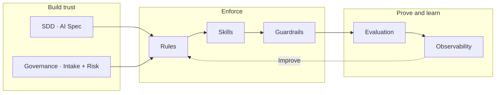

---

## 3. Scope

This framework applies to all AI-enabled systems developed, purchased, configured, or deployed by [Company Name].

### In Scope

This includes systems that use:

- Large Language Models
- Generative AI
- Retrieval-Augmented Generation
- AI agents
- Machine learning models
- Recommendation systems
- Classification models
- Summarization tools
- AI-assisted decision support
- AI-powered automation
- AI coding or engineering assistants used in delivery workflows

### Out of Scope

The following are out of scope unless they directly affect production systems or regulated workflows:

- Personal experimentation
- Informal AI usage without company data
- Public AI tools used only for learning
- Non-production prototypes that do not process sensitive data

---

## 4. AI Native SDLC Principles

[Company Name] follows these principles when delivering AI-enabled software.

### 4.1 AI Assists Before It Decides

AI systems should assist users before they are allowed to make decisions automatically.

High-impact decisions must remain under human control unless explicitly approved through governance.

### 4.2 Specification Before Generation

AI systems must be designed using clear specifications before implementation.

Prompts, models, tools, data access, evaluation rules, and safety constraints must be defined before production use.

### 4.3 Prompts Are Code

Production prompts must be versioned, reviewed, tested, monitored, and rollback-capable.

### 4.4 Models Are Dependencies

Models must be treated as external dependencies with versioning, performance expectations, latency constraints, cost limits, and vendor risk review.

### 4.5 Data Access Must Be Controlled

AI systems must only access data that the user, service, or workflow is authorized to use.

Sensitive data must be minimized, masked, redacted, or restricted where appropriate.

### 4.6 Evaluation Is Required

AI output must be evaluated before release and continuously monitored after release.

Subjective quality checks are not enough.

### 4.7 Human Oversight Is Required for High-Risk Workflows

Human review is required when AI affects people, money, legal outcomes, compliance decisions, security actions, or irreversible system changes.

### 4.8 AI Systems Must Be Observable

AI systems must be monitored for quality, cost, latency, safety, failures, and drift.

### 4.9 Safe Failure Is Mandatory

AI systems must have fallback behavior, escalation paths, and rollback mechanisms.

---

## 5. AI Use Case Intake

Every AI initiative must start with an AI Use Case Intake.

**Template:** [`templates/use-case-intake.md`](./templates/use-case-intake.md)

### 5.1 Use Case Information

| Field | Value |
| --- | --- |
| Use Case Name | [Name] |
| Business Owner | [Name / Team] |
| Technical Owner | [Name / Team] |
| Request Date | [Date] |
| Target Users | [Internal / External / Customer / Partner] |
| Business Problem | [Describe the problem] |
| Expected Business Value | [Describe expected benefit] |
| Success Metrics | [Define measurable outcomes] |

### 5.2 AI Capability Type

Select all that apply:

- Text generation
- Text summarization
- Classification
- Search / Retrieval
- RAG
- AI agent
- Tool execution
- Recommendation
- Prediction
- Image generation
- Speech processing
- Code generation
- Workflow automation
- Other: [Describe]

### 5.3 AI Action Type

Select one:

- AI provides information
- AI summarizes information
- AI drafts content
- AI recommends an action
- AI executes an action after human approval
- AI executes an action automatically
- AI makes a decision

### 5.4 Data Used

| Data Source | Data Type | Owner | Sensitivity | Approved? |
| --- | --- | --- | --- | --- |
| [Example: Resume DB] | Personal data | HR | High | Yes / No |
| [Example: Product Docs] | Internal docs | Product | Medium | Yes / No |

### 5.5 Initial Risk Assessment

| Question | Answer |
| --- | --- |
| Does this system affect customers or employees? | Yes / No |
| Does this system use personal data? | Yes / No |
| Does this system use confidential data? | Yes / No |
| Can the output cause financial impact? | Yes / No |
| Can the output cause legal or compliance impact? | Yes / No |
| Can the system take actions automatically? | Yes / No |
| Is human review required? | Yes / No |
| Is the system customer-facing? | Yes / No |

---

## 6. AI Risk Classification

Each AI use case must be assigned a risk level.

**Template:** [`templates/risk-classification.md`](./templates/risk-classification.md)

### 6.1 Risk Levels

| Risk Level | Description | Examples |
| --- | --- | --- |
| **Low** | Low business or user impact | Internal summarizer, draft generator |
| **Medium** | Business process support with limited impact | Internal knowledge assistant, support draft assistant |
| **High** | Impacts people, money, compliance, legal, security, or customer experience | Hiring summaries, financial recommendations, legal document review |
| **Critical** | Automated high-impact decisions or irreversible actions | Automated loan denial, medical diagnosis, autonomous financial execution |

### 6.2 Assigned Risk Level

| Field | Value |
| --- | --- |
| Risk Level | Low / Medium / High / Critical |
| Reason | [Explain why this risk level applies] |

### 6.3 Required Controls

| Control | Required? | Notes |
| --- | --- | --- |
| Human review | Yes / No | [Details] |
| Prompt versioning | Yes / No | [Details] |
| Model approval | Yes / No | [Details] |
| Data governance review | Yes / No | [Details] |
| Evaluation dataset | Yes / No | [Details] |
| Bias testing | Yes / No | [Details] |
| Security review | Yes / No | [Details] |
| Audit logging | Yes / No | [Details] |
| Monitoring dashboard | Yes / No | [Details] |
| Rollback plan | Yes / No | [Details] |
| Policy rules | Yes / No | [Details] |
| Required skills | Yes / No | [Details] |
| Runtime guardrails | Yes / No | [Details] |

### 6.4 Governance Review (Medium+ Risk)

Medium, High, and Critical use cases require governance review before build and production.

| Role | Responsibility |
| --- | --- |
| Product | Business value and user impact |
| Engineering | Architecture, implementation, delivery |
| Security | Data exposure, secrets, abuse prevention |
| Legal / Compliance | Regulatory and policy risk |
| Data / ML / AI Lead | Model choice, evaluation, monitoring |
| Operations / SRE | Reliability, cost, observability |

Reviews aim for safety, not bureaucracy. Outcomes: approve for specification, defer, or reject with required changes.

See [Appendix H — Workshop Diagrams](#34-appendix-h-workshop-diagrams) for the governance review flow diagram.

## 7. AI System Specification

Every approved AI use case must have an AI System Specification.

**Template:** [`templates/ai-system-specification.md`](./templates/ai-system-specification.md)

When AI agents will generate implementation or tests, teams must also produce a machine-readable feature contract and generation plans.

**Templates:**

- [`templates/feature-ai-spec.yml`](./templates/feature-ai-spec.yml)
- [`templates/code-generation-plan.md`](./templates/code-generation-plan.md)
- [`templates/ai-test-generation-plan.md`](./templates/ai-test-generation-plan.md)

### 7.1 System Overview

| Field | Value |
| --- | --- |
| System Name | [Name] |
| AI Capability | [Description] |
| Primary Users | [Users] |
| Business Workflow | [Workflow description] |
| Production Criticality | Low / Medium / High |

### 7.2 Functional Requirements

| ID | Requirement | Priority |
| --- | --- | --- |
| FR-001 | [Requirement] | Must / Should / Could |
| FR-002 | [Requirement] | Must / Should / Could |

### 7.3 Non-Functional Requirements

| Category | Requirement |
| --- | --- |
| Latency | [Example: P95 under 5 seconds] |
| Availability | [Example: 99.5%] |
| Cost | [Example: Max $0.03 per request] |
| Privacy | [Requirement] |
| Security | [Requirement] |
| Explainability | [Requirement] |
| Auditability | [Requirement] |

### 7.4 Inputs

| Input | Source | Required? | Validation |
| --- | --- | --- | --- |
| [Input name] | [Source] | Yes / No | [Validation rule] |

### 7.5 Outputs

| Output | Format | Consumer | Validation |
| --- | --- | --- | --- |
| [Output name] | JSON / Text / Markdown | [User/System] | [Validation rule] |

### 7.6 Output Schema

```json
{
  "field_1": "string",
  "field_2": ["string"],
  "confidence": "high | medium | low",
  "warnings": ["string"]
}
```

### 7.7 Failure Behavior

| Scenario | Expected Behavior |
| --- | --- |
| Model unavailable | [Fallback behavior] |
| Invalid model output | [Retry / fail gracefully] |
| Missing input data | [Warning / block request] |
| Unsafe output detected | [Block / escalate] |
| Retrieval returns no result | [Say insufficient information] |
| Tool execution fails | [Rollback / ask user / retry] |

---

## 8. Approved AI Architecture Pattern

Select the architecture pattern for this use case.

**Template:** [`templates/architecture-pattern.md`](./templates/architecture-pattern.md)

### 8.1 Pattern Selection

- Prompt-only LLM
- LLM with structured output
- RAG
- Agent with tools
- Multi-agent workflow
- ML model inference
- Hybrid AI workflow
- Other: [Describe]

### 8.2 Architecture Diagram

```
[User]
   ↓
[Application UI]
   ↓
[Backend API]
   ↓
[AI Orchestration Layer]
   ↓
[Prompt / RAG / Agent / Model]
   ↓
[Validation Layer]
   ↓
[Response / Action / Human Review]
```

### 8.3 Components

| Component | Responsibility |
| --- | --- |
| UI | [Description] |
| Backend API | [Description] |
| AI Orchestrator | [Description] |
| Prompt Manager | [Description] |
| Model Provider | [Description] |
| Retriever | [Description, if applicable] |
| Tool Executor | [Description, if applicable] |
| Validation Layer | [Description] |
| Audit Logger | [Description] |
| Monitoring | [Description] |

---

## 9. Data Governance

**Template:** [`templates/data-governance-assessment.md`](./templates/data-governance-assessment.md)

### 9.1 Data Classification

| Data Element | Classification | Allowed for AI? | Handling Rule |
| --- | --- | --- | --- |
| [Data element] | Public / Internal / Confidential / Personal / Regulated | Yes / No | [Rule] |

### 9.2 Data Minimization

Describe what data is removed, masked, or excluded before sending to the AI model.

Data excluded:

- [Example: phone number]
- [Example: personal address]
- [Example: secrets]
- [Example: unnecessary identifiers]

### 9.3 Access Control

The AI system may only retrieve or process data the current user or service is authorized to access.

### 9.4 Data Retention

| Data | Stored? | Retention Period | Notes |
| --- | --- | --- | --- |
| Prompt | Yes / No | [Duration] | [Notes] |
| Response | Yes / No | [Duration] | [Notes] |
| Metadata | Yes / No | [Duration] | [Notes] |
| Retrieved documents | Yes / No | [Duration] | [Notes] |

---

## 10. Model Governance

**Template:** [`templates/model-card.md`](./templates/model-card.md)

### 10.1 Model Selection

| Field | Value |
| --- | --- |
| Model Provider | [Provider] |
| Model Name | [Model] |
| Model Version | [Version] |
| Hosting Type | External API / Private Cloud / Self-hosted |
| Approved For Data Type | [Public/Internal/Confidential/etc.] |
| Context Window | [Size] |
| Expected Latency | [Target] |
| Expected Cost | [Target] |

### 10.2 Model Selection Criteria

| Criteria | Notes |
| --- | --- |
| Accuracy | [Notes] |
| Latency | [Notes] |
| Cost | [Notes] |
| Privacy | [Notes] |
| Security | [Notes] |
| Vendor risk | [Notes] |
| Structured output support | [Notes] |
| Tool calling support | [Notes] |

### 10.3 Fallback Model

| Field | Value |
| --- | --- |
| Fallback Model | [Name] |
| Fallback Trigger | Timeout / provider outage / cost limit / quality issue |
| Fallback Limitations | [Describe] |

---

## 11. Prompt Management

**Template:** [`templates/prompt-card.md`](./templates/prompt-card.md)

### 11.1 Prompt Card

| Field | Value |
| --- | --- |
| Prompt Name | [Name] |
| Prompt Version | [v1] |
| Owner | [Team] |
| Purpose | [Purpose] |
| Model | [Model] |
| Created Date | [Date] |
| Last Updated | [Date] |

### 11.2 Prompt Template

**System:**

[Define the assistant role, constraints, safety rules, and output expectations.]

**User:**

[Define input variables.]

**Output:**

[Define expected format.]

### 11.3 Prompt Variables

| Variable | Description | Required? |
| --- | --- | --- |
| `{{input_1}}` | [Description] | Yes / No |
| `{{input_2}}` | [Description] | Yes / No |

### 11.4 Prompt Safety Rules

The prompt must:

- Use only the provided data
- Avoid unsupported claims
- Avoid sensitive attribute inference
- Follow the expected output schema
- Declare uncertainty when information is missing
- Refuse or escalate unsafe requests

### 11.5 Prompt Versioning

Prompts must be stored in source control:

```
/prompts/[domain]/[prompt-name]-v[number].prompt
```

Prompt changes must go through:

- Pull request review
- Evaluation test run
- Regression check
- Approval for production use

---

## 12. RAG Governance

Complete this section if the system uses Retrieval-Augmented Generation.

**Template:** [`templates/rag-governance.md`](./templates/rag-governance.md)

### 12.1 Knowledge Sources

| Source | Owner | Update Frequency | Access Control Required? |
| --- | --- | --- | --- |
| [Document source] | [Owner] | Daily/Weekly/etc. | Yes / No |

### 12.2 Retrieval Strategy

| Setting | Value |
| --- | --- |
| Embedding Model | [Model] |
| Vector Store | [Postgres pgvector / OpenSearch / Pinecone / etc.] |
| Chunk Size | [Value] |
| Chunk Overlap | [Value] |
| Top-K | [Value] |
| Reranking | Yes / No |
| Metadata Filtering | Yes / No |
| Access Filtering | Yes / No |

### 12.3 RAG Requirements

The system must:

- Cite sources when answering
- Avoid answering when sources are insufficient
- Respect user-level access control
- Prefer fresh documents over stale documents
- Log retrieved document IDs for audit

### 12.4 RAG Evaluation

| Metric | Target |
| --- | --- |
| Retrieval relevance | [Target] |
| Citation accuracy | [Target] |
| Answer groundedness | [Target] |
| No-answer correctness | [Target] |
| Unauthorized document retrieval | 0 |

---

## 13. Agent and Tool Governance

Complete this section if the system uses AI agents or tool execution.

**Template:** [`templates/agent-tool-governance.md`](./templates/agent-tool-governance.md)

### 13.1 Agent Responsibilities

**Agent Name:** [Name]

**Allowed Responsibilities:**

- [Responsibility 1]
- [Responsibility 2]

**Not Allowed:**

- [Forbidden action 1]
- [Forbidden action 2]

### 13.2 Tool Allowlist

| Tool | Purpose | Risk Level | Human Approval Required? |
| --- | --- | --- | --- |
| [Tool name] | [Purpose] | Low / Medium / High | Yes / No |

### 13.3 Tool Execution Rules

The agent must:

- Use only approved tools
- Validate inputs before tool execution
- Validate tool outputs before responding
- Ask for human approval before risky actions
- Never execute destructive actions without authorization
- Log all tool calls

### 13.4 Human Approval Required For

- Sending external emails
- Deleting records
- Updating customer data
- Changing production configuration
- Approving financial transactions
- Making employment-related decisions
- Other: [Describe]

---

## 14. AI Evaluation Framework

**Template:** [`templates/evaluation-report.md`](./templates/evaluation-report.md)

### 14.1 Evaluation Dataset

| Dataset | Purpose | Owner | Size |
| --- | --- | --- | --- |
| Golden dataset | Expected behavior validation | [Owner] | [Number] |
| Safety dataset | Unsafe input testing | [Owner] | [Number] |
| Regression dataset | Prevent behavior degradation | [Owner] | [Number] |

### 14.2 Evaluation Metrics

| Metric | Target | Actual | Status |
| --- | --- | --- | --- |
| Output format validity | [Target] | [Actual] | Pass / Fail |
| Factual accuracy | [Target] | [Actual] | Pass / Fail |
| Relevance | [Target] | [Actual] | Pass / Fail |
| Groundedness | [Target] | [Actual] | Pass / Fail |
| Safety compliance | [Target] | [Actual] | Pass / Fail |
| Bias-sensitive output | [Target] | [Actual] | Pass / Fail |
| Latency | [Target] | [Actual] | Pass / Fail |
| Cost per request | [Target] | [Actual] | Pass / Fail |

### 14.3 Release Gate

The AI system may be released only if:

- Required evaluation metrics pass
- No critical safety failures exist
- Security review is complete
- Human review process is defined
- Required rules, skills, and guardrails are configured
- Rollback plan exists
- Monitoring is configured

---

## 15. AI Testing Strategy

**Template:** [`templates/test-case.md`](./templates/test-case.md)

### 15.1 Required Test Categories

- Happy path tests
- Edge case tests
- Missing input tests
- Ambiguous input tests
- Invalid output tests
- Prompt injection tests
- Sensitive data leakage tests
- Unauthorized access tests
- Hallucination tests
- RAG grounding tests
- Tool failure tests
- Model timeout tests
- Regression tests

### 15.2 Test Case Template

| Field | Value |
| --- | --- |
| Test ID | [ID] |
| Scenario | [Scenario] |
| Input | [Input] |
| Expected Output | [Expected output] |
| Risk Covered | [Risk] |
| Status | Pass / Fail |

---

## 16. Security Review

**Template:** [`templates/security-review-checklist.md`](./templates/security-review-checklist.md)

### 16.1 AI Security Threats

The system must be reviewed for:

- Prompt injection
- Jailbreak attempts
- Sensitive data leakage
- Unauthorized retrieval
- Tool abuse
- Data exfiltration
- Model output misuse
- Excessive permissions
- Secrets exposure
- Insecure logs

### 16.2 Security Controls

| Control | Implemented? | Notes |
| --- | --- | --- |
| Input validation | Yes / No | [Notes] |
| Output validation | Yes / No | [Notes] |
| Prompt injection protection | Yes / No | [Notes] |
| Role-based access control | Yes / No | [Notes] |
| Data redaction | Yes / No | [Notes] |
| Tool allowlist | Yes / No | [Notes] |
| Rate limiting | Yes / No | [Notes] |
| Audit logging | Yes / No | [Notes] |
| Secrets protection | Yes / No | [Notes] |

---

## 17. Human Oversight

**Template:** [`templates/human-review-procedure.md`](./templates/human-review-procedure.md)

For SDLC artifact review, AI-generated code/tests, release approvals, and manual operational actions, use the manual review workflow template.

**Template:** [`templates/manual-review-and-approval-workflow.md`](./templates/manual-review-and-approval-workflow.md)

### 17.1 Human Review Policy

Human review is required when AI output:

- Affects employment, credit, legal, medical, financial, or compliance decisions
- Sends communication externally
- Updates important business records
- Executes irreversible actions
- Produces customer-facing content in sensitive domains
- Has low confidence
- Contains warnings or uncertainty

### 17.2 Review Workflow

```
AI generates output
   ↓
System marks output as draft
   ↓
Human reviews
   ↓
Human accepts, edits, rejects, or escalates
   ↓
Final action is recorded
```

### 17.3 Reviewer Responsibilities

| Reviewer | Responsibility |
| --- | --- |
| [Role] | [Responsibility] |

---

## 18. CI/CD for AI Systems

### 18.1 Pipeline Requirements

```
Code commit
   ↓
Static checks
   ↓
Unit tests
   ↓
Prompt tests
   ↓
Schema validation tests
   ↓
Golden dataset evaluation
   ↓
Safety tests
   ↓
Security checks
   ↓
Cost and latency benchmark
   ↓
Staging deployment
   ↓
Production approval
```

### 18.2 Versioned Artifacts

The following must be versioned:

- Source code
- Prompt templates
- Model configuration
- Tool definitions
- RAG configuration
- Evaluation datasets
- Safety rules
- Policy rules and skill bindings
- Guardrail configuration
- Output schemas
- Deployment configuration

---

## 19. Deployment and Release Strategy

### 19.1 Release Method

Select one or more:

- Internal alpha
- Internal beta
- Feature flag
- Shadow mode
- Canary release
- A/B test
- Limited production rollout
- Full production rollout

### 19.2 Rollout Plan

| Phase | Audience | Duration | Success Criteria |
| --- | --- | --- | --- |
| Phase 1 | [Users] | [Duration] | [Criteria] |
| Phase 2 | [Users] | [Duration] | [Criteria] |
| Phase 3 | [Users] | [Duration] | [Criteria] |

### 19.3 Rollback Plan

**Rollback trigger:**

- [Trigger]

**Rollback action:**

- Disable feature flag
- Revert prompt version
- Revert model version
- Disable tool execution
- Revert guardrail configuration
- Restore previous workflow

---

## 20. Observability and Monitoring

### 20.1 Technical Metrics

Monitor:

- Request count
- Latency
- Error rate
- Timeout rate
- Token usage
- Cost per request
- Cost per day
- Model provider failures
- JSON/schema validation failures
- Tool execution failures

### 20.2 AI Quality Metrics

Monitor:

- User acceptance rate
- User edit rate
- Regeneration rate
- Human override rate
- Reported issue rate
- Hallucination reports
- Unsafe output rate
- Low-confidence rate
- Escalation rate

### 20.3 RAG Metrics

If applicable, monitor:

- Retrieval hit rate
- Top-K relevance
- Citation accuracy
- Groundedness
- No-answer rate
- Stale document usage
- Unauthorized retrieval attempts

### 20.4 Agent Metrics

If applicable, monitor:

- Tool selection accuracy
- Tool execution success rate
- Number of steps per task
- Failed plans
- Human approval rate
- Unauthorized action attempts

---

## 21. Audit Logging

The system must capture enough metadata to support traceability.

### 21.1 Required Audit Fields

| Field | Required? |
| --- | --- |
| Request ID | Yes |
| User ID or service ID | Yes |
| Use case ID | Yes |
| Prompt version | Yes |
| Model name and version | Yes |
| Input classification | Yes |
| Retrieved document IDs | If RAG |
| Tool calls | If agent |
| Output validation result | Yes |
| Safety validation result | Yes |
| Guardrail results | Yes |
| Human review status | If applicable |
| Cost | Yes |
| Latency | Yes |
| Timestamp | Yes |

### 21.2 Sensitive Logging Rules

Do not log secrets, credentials, full personal data, or regulated data unless explicitly approved.

Prefer metadata over full prompt and response storage.

---

## 22. AI Incident Management

**Template:** [`templates/incident-report.md`](./templates/incident-report.md)

### 22.1 AI Incident Examples

An AI incident includes:

- Sensitive data leakage
- Unauthorized document retrieval
- Harmful or unsafe output
- Discriminatory output
- Hallucinated information used in a workflow
- Incorrect tool execution
- Unapproved automated decision
- Cost spike
- Prompt injection success
- Model provider outage affecting production

### 22.2 Incident Response Process

1. Detect issue
2. Classify severity
3. Disable feature or affected capability if needed
4. Preserve logs and traces
5. Identify affected users or records
6. Roll back prompt, model, tool, or guardrail
7. Fix root cause
8. Add regression tests
9. Update documentation, rules, skills, or guardrails
10. Communicate resolution

### 22.3 Incident Severity

| Severity | Description | Response |
| --- | --- | --- |
| **Low** | Minor quality issue | Track and fix |
| **Medium** | User-impacting issue without major harm | Prioritize fix |
| **High** | Sensitive, legal, financial, or reputational risk | Immediate response |
| **Critical** | Major harm, unauthorized action, or regulated impact | Disable feature and escalate |

---

## 23. Roles and Responsibilities

AI-native delivery must distinguish accountable human roles from AI SDLC agents.

AI agents may draft artifacts, generate code, generate tests, summarize evidence, and recommend changes. Humans remain accountable for approvals, risk acceptance, policy exceptions, merge readiness, and production release.

**Template:** [`templates/role-and-agent-operating-model.md`](./templates/role-and-agent-operating-model.md)

| Role | Responsibility |
| --- | --- |
| Business Owner | Defines business value and success criteria |
| Product Owner | Owns workflow and user experience |
| AI Architect | Defines AI architecture and governance controls |
| Software Engineer / Engineering Team | Implements the AI system and reviews AI-generated code |
| Data Owner | Approves data usage |
| Security Team | Reviews security risks |
| Compliance / Legal | Reviews regulatory and policy risks |
| QA Team | Owns evaluation and regression testing |
| SRE / Operations | Owns monitoring, reliability, and incident response |
| Human Reviewer | Reviews AI output where required |

### 23.1 AI SDLC Agents

Define any AI agents used during delivery before they are allowed to generate or change project artifacts.

| Agent | Purpose | Human accountable owner |
| --- | --- | --- |
| Product Analyst Agent | Drafts intake, user stories, acceptance criteria | Product Owner |
| Architecture Agent | Drafts AI spec, architecture, controls | AI Architect |
| Coding Agent | Generates implementation and unit tests | Software Engineer |
| AI Test Agent | Generates eval cases, test runners, reports | QA / AI Tester |
| Security Review Agent | Drafts threat review and findings | Security Reviewer |
| Release Readiness Agent | Drafts readiness evidence and rollback notes | Product Owner / SRE |

### 23.2 Approval Boundaries

| Boundary | Rule |
| --- | --- |
| Scope | AI agents may propose scope; Product Owner approves. |
| Architecture | AI agents may propose patterns; AI Architect approves. |
| Code | Coding agents may generate code; Software Engineer reviews and owns merge readiness. |
| Tests | Test agents may generate evals; QA / AI Tester owns coverage acceptance. |
| Security | Security agents may draft findings; Security Reviewer approves outcome. |
| Data | Agents may classify draft data usage; Data Owner approves usage. |
| Release | Agents may assemble evidence; humans approve production release. |

### 23.3 Agent Run State

Every AI SDLC agent task should create a durable run folder under the use-case documentation packet.
Runner defaults, agent aliases, required specs, reviewers, and verification commands should be configured in `.ai-sdlc.json`. Start from [`templates/ai-sdlc-run-config.json`](./templates/ai-sdlc-run-config.json).

Example:

```bash
ai-sdlc start \
  --agent coding \
  --task "Implement the approved feature from the AI specs"
```

Install `ai-sdlc` with `make install-cli` on Linux/macOS or `.\scripts\install-cli.ps1` on Windows PowerShell.

The runner is tool-agnostic. Configure `defaultRunner` and `runners` in `.ai-sdlc.json`, then execute with:

```bash
ai-sdlc run --runner codex [run-dir]
ai-sdlc run --runner claude [run-dir]
ai-sdlc run --runner cursor [run-dir]
ai-sdlc run --runner manual [run-dir]
```

Use the `manual` runner when the selected tool is not installed or when governance requires the prompt to be pasted into a reviewed environment.

The run folder must capture:

| File | Purpose |
| --- | --- |
| `state.json` | Current agent run state |
| `required-specs.txt` | Specs the agent must read before work |
| `agent-prompt.md` | Prompt used to run or instruct the agent |
| `transcript.log` | Agent execution transcript, when available |
| `handoff.md` | Agent summary, files changed, commands run, and risks |
| `review.md` | Human reviewer checklist and decision |
| `events.md` | Append-only run history |

AI agents may update state and handoff files, but the human reviewer records the approval decision in `review.md`.

---

## 24. Production Readiness Checklist

**Template:** [`templates/production-readiness-checklist.md`](./templates/production-readiness-checklist.md)

### Business

- [ ] Business owner assigned
- [ ] Product Owner and accountable human roles assigned
- [ ] Role and agent operating model completed, if AI agents assist delivery
- [ ] Manual review and approval workflow completed
- [ ] Success metrics defined
- [ ] User workflow approved
- [ ] Support process defined

### Risk

- [ ] Risk level assigned
- [ ] Required controls identified
- [ ] Human review defined
- [ ] Compliance review completed, if needed

### Data

- [ ] Data sources approved
- [ ] Sensitive data identified
- [ ] Data minimization implemented
- [ ] Access control enforced
- [ ] Retention policy defined

### Prompt and Model

- [ ] Prompt versioned
- [ ] Prompt reviewed
- [ ] Model approved
- [ ] Output schema defined
- [ ] Fallback behavior defined

### Evaluation

- [ ] Golden dataset created
- [ ] Evaluation metrics defined
- [ ] Required scores achieved
- [ ] Safety tests passed
- [ ] Regression tests passed
- [ ] Bias-sensitive testing completed, if applicable

### Security

- [ ] Prompt injection tested
- [ ] Unauthorized access tested
- [ ] Sensitive data leakage tested
- [ ] Tool permissions reviewed, if applicable
- [ ] Audit logging enabled

### Rules, Skills, and Guardrails

- [ ] Org and repo policy rules defined (permit/deny boundaries)
- [ ] Required skills bound to use case and SDLC phase
- [ ] Runtime guardrails configured (input, output, tool scope)
- [ ] Guardrail bypass requires documented exception and expiry
- [ ] Rule/skill/guardrail changes versioned with prompt and model

### Operations

- [ ] Feature flag configured
- [ ] Monitoring dashboard created
- [ ] Alerts configured
- [ ] Cost limits configured
- [ ] Rollback plan documented
- [ ] Incident process defined

---

## 25. Continuous Improvement

AI systems must be reviewed periodically after production release.

### 25.1 Review Cadence

| Review Type | Frequency |
| --- | --- |
| Quality review | Weekly / Monthly |
| Cost review | Weekly / Monthly |
| Security review | Quarterly |
| Prompt review | As needed |
| Model review | Quarterly or when provider changes |
| Governance review | Quarterly |
| Rules / skills / guardrails review | Quarterly or after incidents |

### 25.2 Improvement Sources

Continuous improvement should use:

- User feedback
- Human reviewer edits
- Production metrics
- Incident reports
- Evaluation failures
- Cost trends
- Model updates
- Security findings
- Regulatory changes
- Guardrail block and escalation rates

### 25.3 Post-Incident Control Updates

When an AI incident or near-miss occurs, update controls in order:

1. **Guardrail** — immediate containment (block pattern, tighten threshold)
2. **Eval case** — regression test so it never ships again
3. **Skill** — fix procedure gap if humans or agents skipped a step
4. **Rule** — policy change if the boundary was unclear

---

## 26. Rules, Skills, and Guardrails

Policies on paper fail without enforceable controls. Use three complementary layers:

| Layer | What it is | When it applies | Primary effect |
| --- | --- | --- | --- |
| **Rules** | Always-on policy constraints | Before and during any AI work | **Permit** or **deny** classes of usage, data, tools, and actions |
| **Skills** | Task-scoped workflows with checklists | When a specific SDLC activity runs | **Guide** correct procedure and **require** validation steps |
| **Guardrails** | Runtime validators on inputs/outputs/tools | Every production AI request | **Block**, **mask**, or **escalate** unsafe behavior |

**Templates:**

- [`templates/policy-rule-card.md`](./templates/policy-rule-card.md)
- [`templates/skill-binding-matrix.md`](./templates/skill-binding-matrix.md)
- [`templates/guardrail-specification.md`](./templates/guardrail-specification.md)
- [`templates/role-and-agent-operating-model.md`](./templates/role-and-agent-operating-model.md)

### 26.1 Rules — Permit and Deny AI Usage

Rules are non-negotiable boundaries. They apply to human developers, coding agents, and production AI features.

#### Rule categories

| Category | Permit examples | Deny examples |
| --- | --- | --- |
| Data | Public docs in external LLM with logging off | Production PII, secrets, credentials in prompts |
| Tools / agents | Read-only query tools with RBAC | Ungoverned delete, email send, prod config change |
| Automation | AI suggests; human approves | Fully automated hiring/finance/legal decisions (high risk) |
| Engineering | AI-assisted code with diff review + tests | Skip auth, disable tests, force-push shared branches |
| Models | Approved model list for risk tier | Random model selection per developer |
| Output use | Validated JSON consumed by app | Raw model output executed as code or SQL |

#### Where rules live

| Scope | Location (examples) | Enforced by |
| --- | --- | --- |
| Enterprise | AI policy handbook, security standards | Governance review, audits |
| Repository | `.cursor/rules/*.mdc`, `AGENTS.md`, `CONTRIBUTING.md` | IDE agents, PR review |
| Service | `application.yml` feature flags, authorization | Runtime config, CI |
| Use case | AI Spec safety constraints section | Team + release gate |

#### Starter deny/require rules

1. No secrets or production PII in external LLM prompts
2. No destructive agent tools without human confirmation
3. No production AI release without eval gate
4. No merge of AI-generated code without review + verification command

#### Example enterprise rules

```
╔══════════════════════════════════════════════════════════════════╗
║  AI-DATA-001 · No secrets in LLM prompts              Type: DENY  ║
╠══════════════════════════════════════════════════════════════════╣
║  Never include API keys, passwords, tokens, or connection        ║
║  strings in prompts to external models.                          ║
╠══════════════════════════════════════════════════════════════════╣
║  Enforcement: secret scanner in CI · output redaction guardrail  ║
║               · security review on AI features                   ║
╚══════════════════════════════════════════════════════════════════╝

╔══════════════════════════════════════════════════════════════════╗
║  AI-AGENT-003 · No destructive tools w/o confirm      Type: DENY  ║
╠══════════════════════════════════════════════════════════════════╣
║  Agents must not execute delete, external send, or financial     ║
║  submit without explicit human confirmation.                     ║
╠══════════════════════════════════════════════════════════════════╣
║  Enforcement: tool allowlist · HITL workflow · audit log         ║
╚══════════════════════════════════════════════════════════════════╝

╔══════════════════════════════════════════════════════════════════╗
║  AI-ENG-002 · No blind merge of agent code          Type: REQUIRE ║
╠══════════════════════════════════════════════════════════════════╣
║  All AI-generated code requires human diff review and passing    ║
║  ./gradlew check (or repo equivalent) before merge.              ║
╠══════════════════════════════════════════════════════════════════╣
║  Enforcement: branch protection · PR template checkbox           ║
╚══════════════════════════════════════════════════════════════════╝
```

### 26.2 Skills — Workflows That Require Validation

Skills are structured playbooks: when to use them, steps to follow, checklists, and expected outputs.

| Artifact | Analogy | Changes when |
| --- | --- | --- |
| Rule | Law | Policy or risk posture changes |
| Skill | Standard operating procedure | Process improves, new failure mode found |
| Prompt | Function implementation | Model, tone, or output format changes |

#### Map skills to SDLC phases

| SDLC phase | Skill purpose | Example skills |
| --- | --- | --- |
| Intake & classification | Frame problem before AI build | `software-design-analysis` |
| AI specification | Write AI Spec / BRD / RFC | `technical-documentation-authoring` |
| Architecture review | Choose pattern (RAG vs agent) | `llm-application-architecture`, `agent-orchestration-design` |
| RAG features | Retrieval design and eval | `rag-architecture-review`, `ai-evaluation-architecture` |
| Agent features | Tools, limits, HITL | `tool-calling-design-review`, `agent-orchestration-design` |
| Build | Safe delegation and review | `ai-assisted-engineering` |
| Backend implementation | Spring AI, ports, guardrails | `java-ai-backend-engineering` |
| Evaluation | Golden sets, release gates | `ai-evaluation-architecture` |
| Production readiness | Operability before launch | `production-readiness-review`, `observability-review` |

### 26.3 Guardrails — Runtime Validation

Guardrails validate each request (and optionally each tool call).

| Type | Validates | On failure |
| --- | --- | --- |
| Input guardrail | User prompt, retrieved context, injected instructions | Block request; return safe message; log metadata |
| Output guardrail | Model text, JSON schema, PII patterns | Block/redact; retry once; escalate to HITL |
| Tool guardrail | Tool name, args, caller permissions | Deny execution; audit attempt |
| Retrieval guardrail | Document ACL, tenant scope, data classification | Filter chunks; abort if leakage risk |
| Cost guardrail | Token budget, step count, loop detection | Stop run; alert ops |

#### Required guardrails by risk tier

| Guardrail | Low | Medium | High | Critical |
| --- | --- | --- | --- | --- |
| Prompt injection (input) | Recommended | Required | Required | Required |
| Output PII/safety patterns | Optional | Required | Required | Required |
| Tool allowlist | If tools used | Required | Required | Required |
| Retrieval ACL filter | If RAG | Required | Required | Required |
| HITL escalation | — | On low confidence | Required | Required |
| Cost/step limits | Recommended | Required | Required | Required |

#### Example guardrail configuration

```yaml
guardrail:
  prompt-injection:
    enabled: true
    threshold: 0.70
  output:
    enabled: true
    blocked-patterns: "(?i)\\b\\d{3}-\\d{2}-\\d{4}\\b"  # example: SSN-like patterns
  tool:
    allowlist: create_ticket,search_docs
    require-approval: send_email,delete_record
  cost:
    max-steps-per-run: 20
    max-tokens-per-request: 8192
```

Apply input/output guardrails on every AI service and agent path — not only chat endpoints.

### 26.4 Validation Chain — Release and Post-Incident

Before release, confirm:

1. Rules defined? Permit/deny for data, tools, automation
2. Skills bound? Required workflows completed this phase
3. Evals passing? Golden set + safety + regression
4. Guardrails enabled? Input/output/tool checks in prod config
5. Observability? Block, escalation, override rates
6. Exception expired? Temporary bypass reviewed or removed

---

## 27. Appendix A: AI Use Case Card Template

See [`templates/use-case-intake.md`](./templates/use-case-intake.md).

---

## 28. Appendix B: Prompt Card Template

See [`templates/prompt-card.md`](./templates/prompt-card.md).

---

## 29. Appendix C: Evaluation Report Template

See [`templates/evaluation-report.md`](./templates/evaluation-report.md).

---

## 30. Appendix D: AI Incident Report Template

See [`templates/incident-report.md`](./templates/incident-report.md).

---

## 31. Appendix E: Recommended AI SDLC Flow

```
AI Idea
   ↓
Use Case Intake
   ↓
Risk Classification
   ↓
AI System Specification
   ↓
Architecture Review
   ↓
Data Governance Review
   ↓
Rules / Skills / Guardrails Design
   ↓
Prompt / Model / RAG / Agent Design
   ↓
Build
   ↓
Evaluation and Testing
   ↓
Security Review
   ↓
Production Readiness Review
   ↓
Controlled Deployment
   ↓
Monitoring
   ↓
Feedback and Continuous Improvement
```

---

## 32. Appendix F: Fourteen Artifacts to Implement First

| # | Artifact | Template |
| --- | --- | --- |
| 1 | Use Case Card | [`templates/use-case-intake.md`](./templates/use-case-intake.md) |
| 2 | Risk Matrix | [`templates/risk-classification.md`](./templates/risk-classification.md) |
| 3 | AI Spec | [`templates/ai-system-specification.md`](./templates/ai-system-specification.md) |
| 4 | Feature AI Spec | [`templates/feature-ai-spec.yml`](./templates/feature-ai-spec.yml) |
| 5 | Role and Agent Operating Model | [`templates/role-and-agent-operating-model.md`](./templates/role-and-agent-operating-model.md) |
| 6 | Code Generation Plan | [`templates/code-generation-plan.md`](./templates/code-generation-plan.md) |
| 7 | AI Test Generation Plan | [`templates/ai-test-generation-plan.md`](./templates/ai-test-generation-plan.md) |
| 8 | Eval Checklist | [`templates/evaluation-report.md`](./templates/evaluation-report.md) |
| 9 | Production Readiness | [`templates/production-readiness-checklist.md`](./templates/production-readiness-checklist.md) |
| 10 | Manual Review and Approval Workflow | [`templates/manual-review-and-approval-workflow.md`](./templates/manual-review-and-approval-workflow.md) |
| 11 | Monitoring Standard | Section 20 of this document |
| 12 | Policy Rule Set | [`templates/policy-rule-card.md`](./templates/policy-rule-card.md) |
| 13 | Skill Binding | [`templates/skill-binding-matrix.md`](./templates/skill-binding-matrix.md) |
| 14 | Guardrail Spec | [`templates/guardrail-specification.md`](./templates/guardrail-specification.md) |

---

## 33. Appendix G: Maturity Roadmap

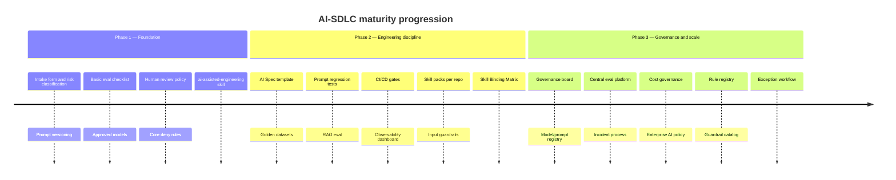

| Phase | Focus |
| --- | --- |
| **1 — Foundation** | Intake form, risk classification, prompt versioning, basic eval checklist, approved models, human review policy, core deny rules, `ai-assisted-engineering` skill |
| **2 — Engineering discipline** | AI Spec template, golden datasets, prompt regression tests, RAG eval, CI/CD gates, observability dashboard, skill packs per repo, input guardrails, Skill Binding Matrix |
| **3 — Governance and scale** | Governance board, model/prompt registry, central eval platform, incident process, cost governance, enterprise AI policy, rule registry, guardrail catalog, exception workflow |

### Framework naming options

| Name | Emphasis |
| --- | --- |
| AI Delivery Governance Framework | Executive / compliance audience |
| AI-SDLC Operating Framework | Engineering orgs |
| Responsible AI Engineering Lifecycle | Policy + engineering balance |
| AI Native SDLC Framework | This document — full lifecycle adoption |

---

## 34. Appendix H: Workshop Diagrams

Copy diagrams into slide decks, Miro boards, or workshop handouts. Export via [Mermaid Live Editor](https://mermaid.live) for PNG/SVG.

### Governance review flow

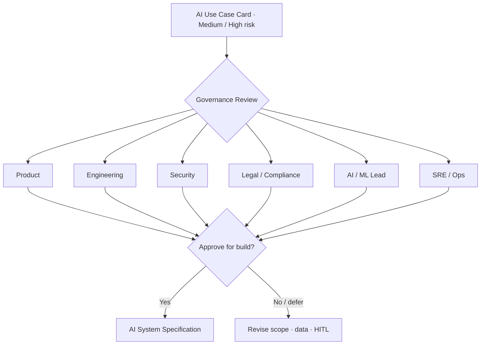

### Risk tiers and controls

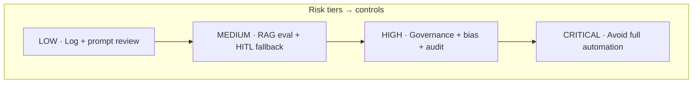

### Data classification pyramid

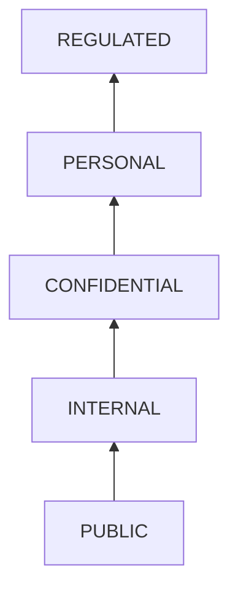

### Architecture patterns

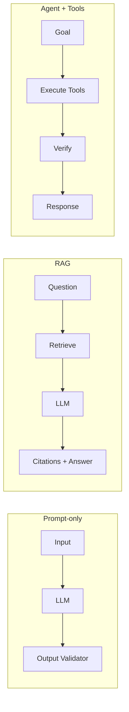

### Prompt lifecycle

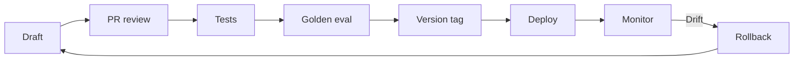

### Evaluation layers

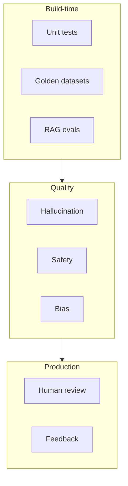

### CI/CD pipeline

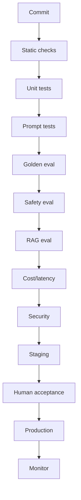

### Three-layer control model

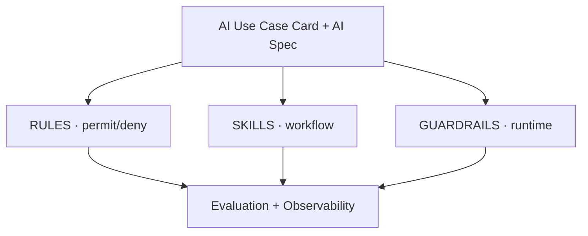

### Guardrail decision flow

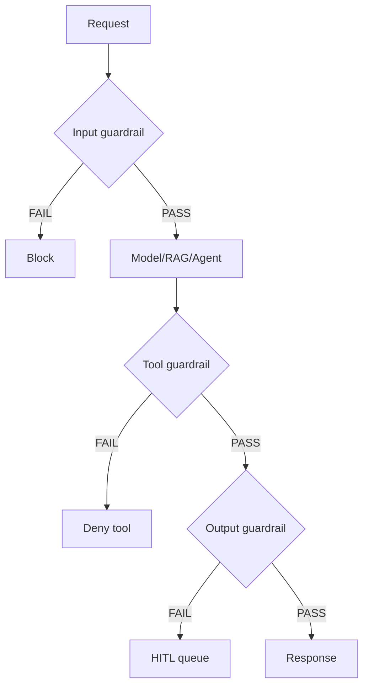

### Incident improvement loop

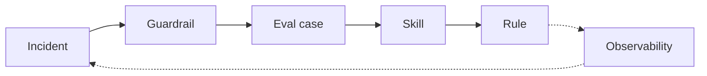

### Operating model cycle

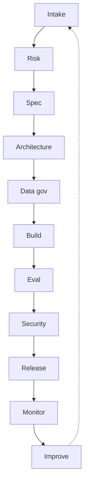

---

## 35. Appendix I: Worked Example — Candidate AI Summary

Use this filled example when onboarding teams to intake and controls.

```
╔══════════════════════════════════════════════════════════════════╗
║  USE CASE: Candidate AI Summary                                  ║
║  OWNER:    Talent Platform Team                                  ║
╠══════════════════════════════════════════════════════════════════╣
║  Goal       Reduce recruiter screening time                      ║
║  AI Type    LLM + RAG                                            ║
║  Users      Internal recruiters                                  ║
║  Data       Resume, job description, candidate profile           ║
╠══════════════════════════════════════════════════════════════════╣
║  Risk       Medium / High                                        ║
║  HITL       Yes              Auto-decision  No                   ║
║  Sensitive  Yes                                                  ║
╠══════════════════════════════════════════════════════════════════╣
║  Eval       Bias, hallucination, factuality, relevance           ║
║  Skills     design-analysis · eval-architecture                  ║
║  Rules      AI-DATA-001 · AI-ENG-002                             ║
║  Guardrails prompt-injection (in) · output safety (PII patterns) ║
╠══════════════════════════════════════════════════════════════════╣
║  MVP        Approved                                             ║
╚══════════════════════════════════════════════════════════════════╝
```

**Prompt safety (candidate-summary-v1):**

- Do not infer age, gender, ethnicity, religion, health, or family status
- Do not make hiring decisions — summarize job-relevant information only
- If resume is incomplete, state what is missing

**Release gate targets:** factual accuracy ≥ 90%, JSON format ≥ 98%, zero critical safety failures, HITL workflow enabled.

---

## 36. Appendix J: Workshop Facilitation Guide

| Exercise | Artifact | Time |
| --- | --- | --- |
| Classify a use case | [`templates/use-case-intake.md`](./templates/use-case-intake.md) | 15 min |
| Map data tier | Data classification pyramid (Appendix H) | 10 min |
| Draft one deny rule | [`templates/policy-rule-card.md`](./templates/policy-rule-card.md) | 10 min |
| Bind skills to phases | [`templates/skill-binding-matrix.md`](./templates/skill-binding-matrix.md) | 15 min |
| Define release gate | [`templates/evaluation-report.md`](./templates/evaluation-report.md) | 20 min |
| Walk guardrail flow | Guardrail decision diagram (Appendix H) | 15 min |

**Export tips:** GitHub/GitLab render Mermaid natively; use Mermaid Live Editor for PNG/SVG; ASCII card boxes print well in monospace PDFs.

---

## Related Documents

| Document | Purpose |
| --- | --- |
| [`templates/README.md`](./templates/README.md) | Operational fillable templates index |
| [`README.md`](./README.md) | Documentation index and recommended workflow |
