# AI-SDLC Framework — Reference & Templates

Companion reference for the LinkedIn article [`ai-sdlc-framework-linkedin.md`](./ai-sdlc-framework-linkedin.md).  
Use this document for internal workshops, governance setup, or Part 2 deep-dives.  
Workshop slide pack: [`ai-sdlc-visual-supplement.md`](./ai-sdlc-visual-supplement.md).

---

## At a glance

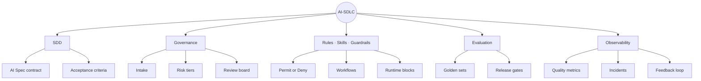

| | |
| --- | --- |
| **Definition** | A specification-driven lifecycle for safely delivering AI capabilities through governed intake, approved architectures, controlled data, versioned prompts, repeatable evaluations, human oversight, and production observability. |
| **Formula** | **AI-SDLC** = SDD + Governance + **Rules / Skills / Guardrails** + Evaluation + Observability |

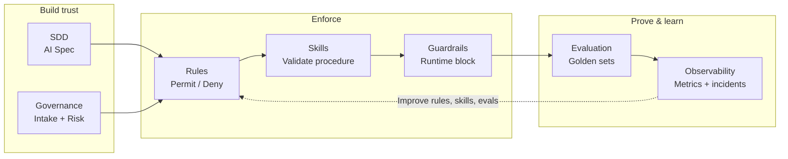

---

## Table of Contents

1. [AI Intake and Use Case Discovery](#1-ai-intake-and-use-case-discovery)
2. [AI Risk Classification](#2-ai-risk-classification)
3. [AI Governance Review Group](#3-ai-governance-review-group)
4. [AI System Specification](#4-ai-system-specification)
5. [Architecture Patterns](#5-architecture-patterns)
6. [Data Governance](#6-data-governance-for-ai)
7. [Prompt Engineering Lifecycle](#7-prompt-engineering-lifecycle)
8. [Model Selection Standard](#8-model-selection-standard)
9. [Evaluation Framework](#9-evaluation-framework)
10. [AI Testing Strategy](#10-ai-testing-strategy)
11. [Security Controls](#11-security-controls)
12. [CI/CD for AI Systems](#12-cicd-for-ai-systems)
13. [Deployment Strategy](#13-deployment-strategy)
14. [Observability and Monitoring](#14-observability-and-monitoring)
15. [Auditability](#15-auditability)
16. [Human-in-the-Loop Design](#16-human-in-the-loop-design)
17. [AI Incident Management](#17-ai-incident-management)
18. [Roles and Responsibilities](#18-roles-and-responsibilities)
19. [Documentation Templates Index](#19-documentation-templates)
20. [Production Readiness Checklist](#20-production-readiness-checklist)
21. [Rules, Skills, and Guardrails](#21-rules-skills-and-guardrails)

---

## 1. AI Intake and Use Case Discovery

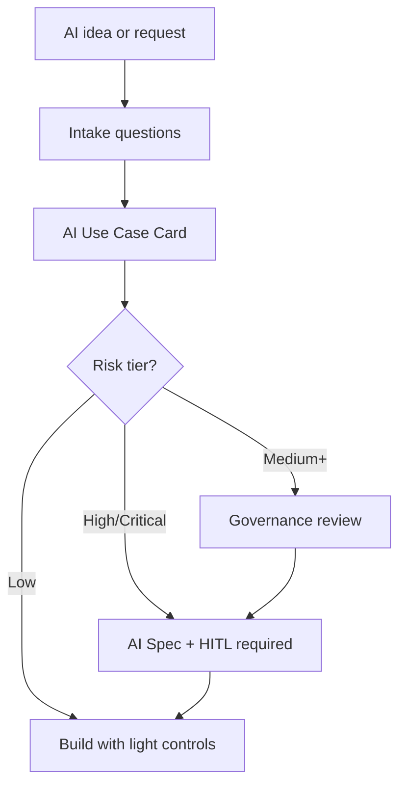

### Discovery card — questions to answer

| Area | Questions |
| --- | --- |
| 💼 Business value | What problem? What metric improves? |
| 👥 User impact | Internal, customers, or public users? |
| ⚖️ Decision type | Suggest, rank, generate, approve, reject, automate? |
| ⚠️ Risk | Financial, legal, privacy, security, reputational harm? |
| 📁 Data | Public, internal, confidential, personal, regulated? |
| 🧑‍⚖️ Human review | Human in the loop required? |
| 🤖 Model type | LLM, RAG, agent, classifier, recommender, vision, speech? |

### 🎴 Template: AI Use Case Card

```
╔══════════════════════════════════════════════════════════════════╗
║  AI USE CASE CARD                                                ║
╠══════════════════════════════════════════════════════════════════╣
║  Use Case:          ___________________________________________  ║
║  Owner:             ___________________________________________  ║
║  Business Goal:     ___________________________________________  ║
║  AI Type:           ___________________________________________  ║
║  Users:             ___________________________________________  ║
║  Data Used:         ___________________________________________  ║
║  Risk Level:        [ ] Low  [ ] Medium  [ ] High  [ ] Critical  ║
║  Human Review:      [ ] Yes  [ ] No                              ║
║  Automated Decision:[ ] Yes  [ ] No   ← prefer No for High+      ║
║  Sensitive Data:    [ ] Yes  [ ] No                              ║
║  Evaluation:        ___________________________________________  ║
║  Required Skills:   ___________________________________________  ║
║  Required Rules:    ___________________________________________  ║
║  Required Guardrails:___________________________________________  ║
║  Approved for MVP:  [ ] Yes  [ ] No                              ║
╚══════════════════════════════════════════════════════════════════╝
```

### 🎴 Example: Candidate AI Summary

```
╔══════════════════════════════════════════════════════════════════╗
║  USE CASE: Candidate AI Summary                                  ║
║  OWNER:    Talent Platform Team                                  ║
╠══════════════════════════════════════════════════════════════════╣
║  Goal       Reduce recruiter screening time                      ║
║  AI Type    LLM + RAG                                            ║
║  Users      Internal recruiters                                 ║
║  Data       Resume, job description, candidate profile           ║
╠══════════════════════════════════════════════════════════════════╣
║  Risk       🟠 Medium / High                                     ║
║  HITL       ✅ Yes          Auto-decision  ❌ No                 ║
║  Sensitive  ✅ Yes                                               ║
╠══════════════════════════════════════════════════════════════════╣
║  Eval       Bias, hallucination, factuality, relevance           ║
║  Skills     design-analysis · eval-architecture · article-author ║
║  Rules      AI-DATA-001 · AI-ENG-002                             ║
║  Guardrails prompt-injection (in) · output safety (PII patterns)   ║
╠══════════════════════════════════════════════════════════════════╣
║  MVP        ✅ Approved                                          ║
╚══════════════════════════════════════════════════════════════════╝
```

---

## 2. AI Risk Classification

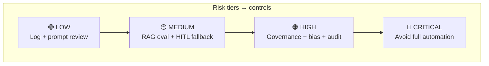

| Tier | Signal | Example | Required controls |
| --- | :---: | --- | --- |
| 🟢 **Low** | Internal only, low harm | Meeting notes, code helper | Logging, prompt review, security check |
| 🟡 **Medium** | Customer-facing Q&A | Support bot, doc search | RAG evals, hallucination tests, monitoring, fallback |
| 🟠 **High** | People / money / compliance | Hiring summary, financial advice | Governance review, bias testing, audit trail, **HITL approval** |
| 🔴 **Critical** | Irreversible automated impact | Loan approval, medical diagnosis | **Do not fully automate** without heavy governance |

```
┌─────────────────────────────────────────────────────────────────┐
│  POLICY RULE (all tiers)                                        │
│                                                                 │
│   AI can ASSIST decisions  →  before  →  AI can MAKE decisions  │
│                                                                 │
│   Especially: hiring · finance · legal · healthcare · access    │
└─────────────────────────────────────────────────────────────────┘
```

---

## 3. AI Governance Review Group

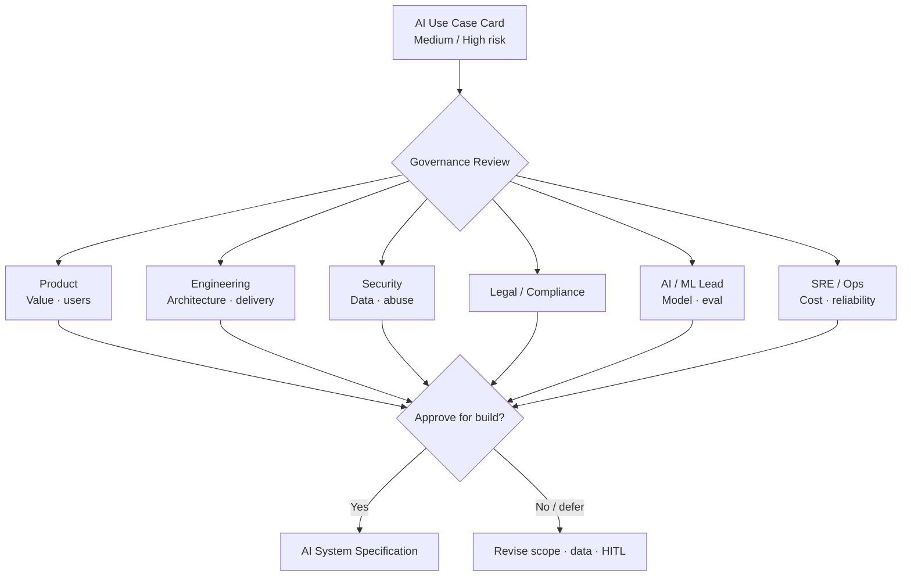

| Role | Responsibility |
| --- | --- |
| Product | Business value and user impact |
| Engineering | Architecture, implementation, delivery |
| Security | Data exposure, secrets, abuse prevention |
| Legal/Compliance | Regulatory and policy risk |
| Data/ML/AI Lead | Model choice, evaluation, monitoring |
| Operations/SRE | Reliability, cost, observability |

Reviews **medium** and **high** risk use cases before production — goal is safety, not bureaucracy.

---

## 4. AI System Specification

The AI Spec is the **contract before code** (SDD-aligned). See [Section 21](#21-rules-skills-and-guardrails) for rule, skill, and guardrail templates.

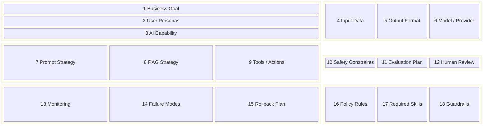

| Block | Sections | Purpose |
| --- | --- | --- |
| 📋 Business | 1–3 | Why and who |
| 📊 Data & model | 4–6 | Inputs, outputs, provider |
| 🏗 Design | 7–9 | Prompt, RAG, agent tools |
| 🛡 Safety | 10–12 | Constraints, eval, HITL |
| 🔧 Operations | 13–15 | Monitor, fail, rollback |
| ⚙️ Controls | 16–18 | Rules, skills, guardrails |

---

## 5. Architecture Patterns

Pick **one approved pattern** per use case. Do not default to “agent” when a pipeline suffices.

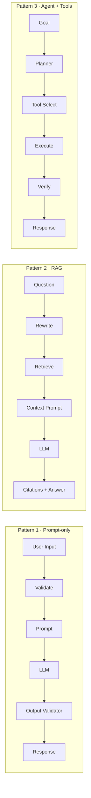

### Pattern comparison card

| | Prompt-only | RAG | Agent + tools |
| --- | --- | --- | --- |
| **Best for** | Rewrite, classify, draft | Policy Q&A, knowledge base | Tickets, CRM, workflows |
| **Complexity** | 🟢 Low | 🟡 Medium | 🟠 High |
| **Key controls** | Output validator | Citations, ACL, “I don’t know” | Allowlist, HITL, audit |
| **Eval focus** | Format, safety | Retrieval + answer | Tool args, multi-step |

### 🎴 Pattern 1 — Prompt-only LLM

Examples: email rewrite, internal notes summary, simple classification.

### 🎴 Pattern 2 — RAG

Required controls: citations · document freshness · chunk quality · retrieval eval · “I don’t know” · **ACL filtering**

### 🎴 Pattern 3 — Agent with tools

Required controls: tool allowlist · permission checks · **human approval for risky actions** · dry-run · audit trail · rate limits · result validation

```
┌──────────────────────────────────────────────────────────┐
│  ⛔ DANGEROUS ACTIONS — always require confirmation       │
├──────────────────────────────────────────────────────────┤
│  Delete records · External email · Approve candidates    │
│  Financial transactions · Production config changes      │
└──────────────────────────────────────────────────────────┘
```

---

## 6. Data Governance for AI

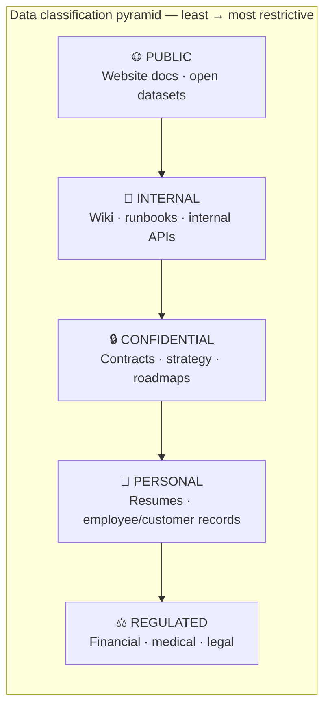

| Tier | Example | AI usage |
| --- | --- | --- |
| 🌐 **Public** | Website docs | ✅ Allowed |
| 🏢 **Internal** | Internal wiki | ✅ Allowed with access control |
| 🔒 **Confidential** | Contracts, strategy | ⚠️ Restricted |
| 👤 **Personal** | Resumes, employee/customer records | 🔍 Requires review |
| ⚖️ **Regulated** | Financial, medical, legal | 🛑 High control |

### Data rules

```
┌──────────────────────────────────────────────────────────────────┐
│  📋 DATA GOVERNANCE RULES — apply before any AI feature ships    │
├──────────────────────────────────────────────────────────────────┤
│  🚫  Do not send secrets to external LLMs                        │
│  🚫  Do not send production personal data unless approved        │
│  ✂️   Apply data minimization — only what the task needs         │
│  🎭  Mask sensitive fields when possible                       │
│  🔐  Enforce user-level authorization before retrieval          │
│  📝  Log metadata, not sensitive content                         │
│  🗄️   Define retention policy for prompts and responses          │
└──────────────────────────────────────────────────────────────────┘
```

---

## 7. Prompt Engineering Lifecycle

Prompts are code: version control, PR review, test, monitor, rollback.

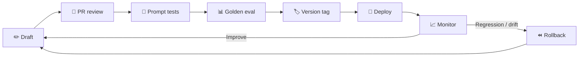

### Template: Prompt Card

```
╔══════════════════════════════════════════════════════════════════╗
║  PROMPT CARD                                                     ║
╠══════════════════════════════════════════════════════════════════╣
║  Prompt Name:       ___________________________________________  ║
║  Version:           ___________________________________________  ║
║  Owner:             ___________________________________________  ║
║  Purpose:           ___________________________________________  ║
║  Model:             ___________________________________________  ║
║  Inputs:            ___________________________________________  ║
║  Output format:     ___________________________________________  ║
║  Safety rules:      ___________________________________________  ║
║  Failure behavior:  ___________________________________________  ║
║  Examples:          ___________________________________________  ║
║  Evaluation cases:  ___________________________________________  ║
╚══════════════════════════════════════════════════════════════════╝
```

### 🎴 Example: candidate-summary-v1

```
╔══════════════════════════════════════════════════════════════════╗
║  PROMPT: candidate-summary-v1                                    ║
║  OWNER:  Recruiting Platform Team                                ║
╠══════════════════════════════════════════════════════════════════╣
║  Purpose    Generate candidate summary for a job opening         ║
║  Model      [approved provider/model]                            ║
║  Inputs     resume · job description · recruiter notes           ║
║  Output     JSON summary                                         ║
╠══════════════════════════════════════════════════════════════════╣
║  SAFETY                                                        ║
║  • Do not infer age, gender, ethnicity, religion, health,      ║
║    or family status                                              ║
║  • Do not make hiring decisions                                  ║
║  • Only summarize job-relevant information                       ║
╠══════════════════════════════════════════════════════════════════╣
║  FAILURE                                                       ║
║  • If resume is incomplete, state what is missing                ║
╚══════════════════════════════════════════════════════════════════╝
```

---

## 8. Model Selection Standard

| Criteria | Evaluate |
| --- | --- |
| Accuracy | Task fit |
| Cost | Token price, volume |
| Latency | Real-time vs async |
| Privacy | External API vs self-hosted |
| Context size | Long documents? |
| Tool use | Function calling support |
| Structured output | JSON reliability |
| Safety | Refusal behavior, policy controls |
| Vendor risk | Lock-in, availability, terms |

### Suggested policy

| Scenario | Policy |
| --- | --- |
| Low-risk internal | Approved external LLMs |
| Confidential business data | Approved vendors, controlled logging, DPA |
| Highly sensitive | Private deployment, self-hosted, or strict redaction |
| High-impact automated decisions | Governance approval + human review |

---

## 9. Evaluation Framework

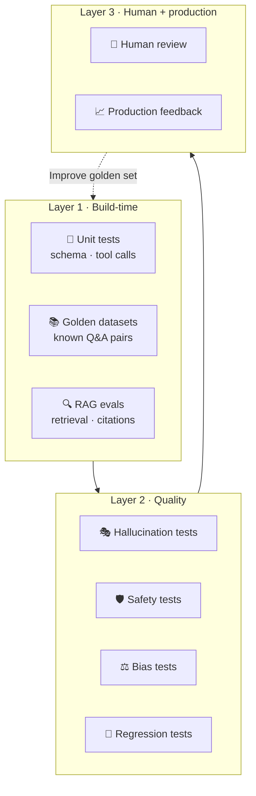

| Evaluation type | Purpose |
| --- | --- |
| 🧪 Unit tests | Prompt formatting, JSON schema, tool calls |
| 📚 Golden datasets | Known questions and expected answers |
| 🔍 RAG evals | Retrieval quality, citation accuracy |
| 🎭 Hallucination tests | Unsupported claims |
| 🛡️ Safety tests | Blocked or risky outputs |
| ⚖️ Bias tests | Unfair treatment |
| 🔄 Regression tests | Prompt/model changes don't break behavior |
| 👤 Human review | Expert scoring |
| 📈 Production feedback | Real-world quality signals |

### AI scorecard (example)

| Metric | Target | Status |
| --- | --- | :---: |
| 📊 Factual Accuracy | ≥ 90% on golden set | ⬜ |
| 🎯 Relevance | 0–5 (avg ≥ 4.0) | ⬜ |
| ✅ Completeness | 0–5 (avg ≥ 4.0) | ⬜ |
| 📎 Citation Quality | ≥ 90% correct | ⬜ |
| 🛡️ Safety | Pass / Fail | ⬜ |
| 📋 Format Compliance | ≥ 98% JSON success | ⬜ |
| ⏱️ Latency | P95 under target ms | ⬜ |
| 💰 Cost per Request | Under budget $ | ⬜ |
| 👍 Human Acceptance Rate | ≥ target % | ⬜ |

### 🎴 Example release gate

```
╔══════════════════════════════════════════════════════════════════╗
║  RELEASE GATE — candidate-summary-v1                             ║
╠══════════════════════════════════════════════════════════════════╣
║  [✓] Factual accuracy        ≥ 90%                               ║
║  [✓] JSON format success     ≥ 98%                               ║
║  [✓] Unsafe response rate    = 0 critical issues                 ║
║  [✓] RAG citation correctness ≥ 90%                              ║
║  [✓] P95 latency             under target                        ║
║  [✓] Cost per request        under budget                        ║
║  [✓] Human reviewer approval completed                         ║
╠══════════════════════════════════════════════════════════════════╣
║  GATE STATUS:  [ ] PASS   [ ] FAIL   [ ] WAIVED (exception)      ║
╚══════════════════════════════════════════════════════════════════╝
```

---

## 10. AI Testing Strategy

### Core test suite

1. Happy path  
2. Edge cases  
3. Ambiguous input  
4. Missing information  
5. Prompt injection  
6. Sensitive data handling  
7. Toxic or abusive input  
8. Long-context  
9. Tool failure  
10. Model timeout  
11. RAG no-result  
12. Regression across prompt/model versions  

### Agent-specific tests

- Wrong tool selection  
- Unauthorized tool access  
- Bad or partial tool data  
- Tool execution timeout  
- Destructive action requests  
- Multi-step workflow interruption  

---

## 11. Security Controls

Review for: prompt injection, data exfiltration, jailbreaks, unauthorized retrieval, tool abuse, insecure plugins, sensitive leakage, over-permissive agents, executable output.

### Required controls

- Input validation  
- Output validation  
- Tool allowlist  
- RBAC and tenant/user document filtering  
- Secret redaction  
- Prompt injection detection  
- Rate limiting  
- Audit logging  
- Human approval for risky actions  

See [Section 21](#21-rules-skills-and-guardrails) for how **rules**, **skills**, and **runtime guardrails** implement these controls at org, workflow, and request level.

---

## 12. CI/CD for AI Systems

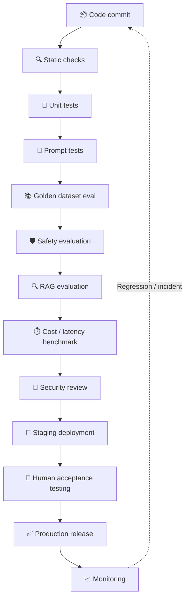

### Version together

| Artifact | Version with release? |
| --- | :---: |
| Application code | ✅ |
| Prompt templates | ✅ |
| Model configuration | ✅ |
| Tool definitions | ✅ |
| RAG chunking and embedding model | ✅ |
| Retrieval parameters | ✅ |
| Evaluation datasets | ✅ |
| Safety rules | ✅ |
| Policy rules and skill bindings | ✅ |
| Guardrail configuration | ✅ |

---

## 13. Deployment Strategy

- Feature flags  
- Internal beta  
- Shadow mode  
- Canary release  
- A/B testing  
- Human-in-the-loop mode  
- Read-only mode for agents  
- Rollback by prompt or model version  

---

## 14. Observability and Monitoring

**Technical:** request count, latency, tokens, cost, model errors, timeouts, tool failures, parse failures  

**Quality:** thumbs up/down, correction rate, hallucination reports, citation accuracy, escalation, refusal, unsafe output rate  

**RAG:** hit rate, top-k relevance, no-result rate, chunk sources, stale docs, citation coverage  

**Agents:** tool selection accuracy, execution success, steps per task, failed plans, approval rate, blocked actions  

---

## 15. Auditability

Per-request metadata (avoid storing full sensitive content unless required):

- Request ID, user/service ID, use case ID  
- Prompt version, model version  
- Input classification  
- Retrieved document IDs  
- Tool calls  
- Output status, safety checks  
- Human approval status  
- Cost, latency, timestamp  

---

## 16. Human-in-the-Loop Design

Human review required when AI:

- Makes recommendations about people  
- Affects employment, credit, finance, legal, healthcare, or access  
- Sends external communication  
- Updates important records  
- Executes irreversible actions  
- Produces compliance-sensitive output  

Review types: approve/reject, edit before send, compare sources, confirm tool action, escalate to expert.

---

## 17. AI Incident Management

### Example incidents

- Sensitive data leaked  
- Harmful or false advice  
- Wrong agent action  
- Unauthorized RAG retrieval  
- Discriminatory output  
- Cost spike from loop or abuse  
- Prompt injection bypass  

### Response

1. Disable feature flag  
2. Preserve logs and traces  
3. Identify affected users  
4. Roll back prompt/model/tool  
5. Notify stakeholders  
6. Fix root cause  
7. Add regression test  
8. Update policy or guardrail  

---

## 18. Roles and Responsibilities

| Role | Responsibility |
| --- | --- |
| Product Owner | Value and acceptance criteria |
| AI Architect | Architecture, model strategy, risk controls |
| Engineering | Implementation |
| Data Owner | Data approval and access |
| Security | Threat modeling and controls |
| QA | Evaluation and regression testing |
| Compliance/Legal | Policy and regulatory review |
| SRE/Ops | Monitoring, reliability, incidents |
| Human Reviewer | Sensitive workflow output review |

---

## 19. Documentation Templates

1. AI Use Case Card  
2. AI Risk Assessment  
3. AI System Specification  
4. Data Usage Assessment  
5. Prompt Card  
6. Model Card  
7. Evaluation Report  
8. Security Review Checklist  
9. Human Review Procedure  
10. Production Readiness Checklist  
11. AI Incident Report  
12. Policy Rule Card  
13. Skill Binding Matrix  
14. Guardrail Specification  

---

## 20. Production Readiness Checklist

### Business

- [ ] Use case approved  
- [ ] Owner assigned  
- [ ] Success metrics defined  

### Risk

- [ ] Risk level assigned  
- [ ] Human review defined  
- [ ] Compliance reviewed if needed  

### Data

- [ ] Data sources approved  
- [ ] Sensitive data identified  
- [ ] Access control enforced  
- [ ] Retention policy defined  

### Prompt / Model

- [ ] Prompt versioned  
- [ ] Model approved  
- [ ] Output schema defined  
- [ ] Fallback behavior defined  

### Evaluation

- [ ] Golden dataset created  
- [ ] Regression tests passing  
- [ ] Safety tests passing  
- [ ] RAG evaluation complete (if applicable)  
- [ ] Bias evaluation complete (if applicable)  

### Security

- [ ] Prompt injection tested  
- [ ] Tool permissions reviewed  
- [ ] Secrets protected  
- [ ] Audit logs enabled  

### Rules / Skills / Guardrails

- [ ] Org and repo **policy rules** defined (permit/deny boundaries)  
- [ ] Required **skills** bound to use case and SDLC phase  
- [ ] Runtime **guardrails** configured (input, output, tool scope)  
- [ ] Guardrail bypass requires documented exception and expiry  
- [ ] Rule/skill/guardrail changes versioned with prompt and model  

### Operations

- [ ] Feature flag enabled  
- [ ] Monitoring dashboard ready  
- [ ] Cost limits configured  
- [ ] Rollback plan documented  
- [ ] Incident process defined  

---

## 21. Rules, Skills, and Guardrails

Policies on paper fail without **enforceable controls**. In an AI SDLC, use three complementary layers:

| Layer | What it is | When it applies | Primary effect |
| --- | --- | --- | --- |
| **Rules** | Always-on policy constraints | Before and during any AI work | **Permit** or **deny** classes of usage, data, tools, and actions |
| **Skills** | Task-scoped workflows with checklists | When a specific SDLC activity runs | **Guide** correct procedure and **require** validation steps |
| **Guardrails** | Runtime validators on inputs/outputs/tools | Every production (and optionally dev) AI request | **Block**, **mask**, or **escalate** unsafe behavior |

Think of it as:

```
┌──────────────────┬────────────────────────────────────────────────┐
│ 📜 RULES         │ What is never allowed (org law)                │
├──────────────────┼────────────────────────────────────────────────┤
│ 🛠️ SKILLS        │ How work must be done (operating procedure)    │
├──────────────────┼────────────────────────────────────────────────┤
│ 🛡️ GUARDRAILS    │ What the system enforces at runtime (safety net)│
└──────────────────┴────────────────────────────────────────────────┘
```

Rules and skills shape behavior upstream; guardrails catch failures downstream. All three should trace back to the **AI Use Case Card** and **AI System Specification**.

### 21.1 Three-layer control model

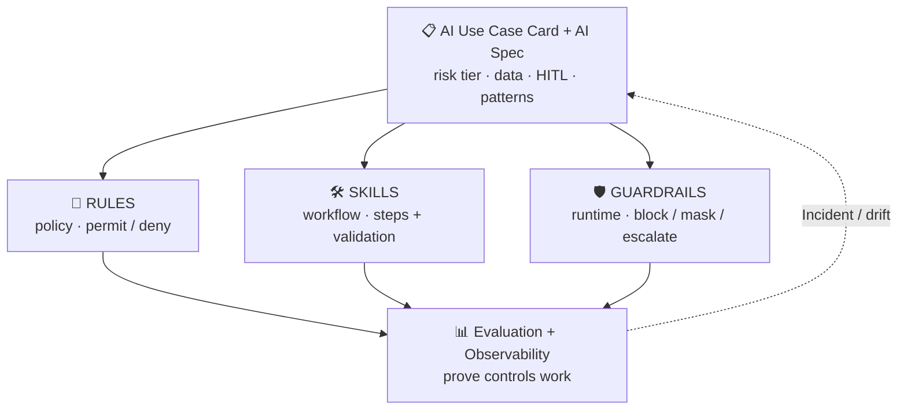

### 21.2 Rules — permit and deny AI usage

**Rules** are non-negotiable boundaries. They apply to human developers, coding agents, and production AI features.

#### Rule categories

| Category | Permit examples | Deny examples |
| --- | --- | --- |
| **Data** | Public docs in external LLM with logging off | Production PII, secrets, credentials in prompts |
| **Tools / agents** | Read-only query tools with RBAC | Ungoverned delete, email send, prod config change |
| **Automation** | AI suggests; human approves | Fully automated hiring/finance/legal decisions (high risk) |
| **Engineering** | AI-assisted code with diff review + tests | Skip auth, disable tests, force-push shared branches |
| **Models** | Approved model list for risk tier | Random model selection per developer |
| **Output use** | Validated JSON consumed by app | Raw model output executed as code or SQL |

#### AI usage permit/deny matrix (by risk tier)

| Activity | Low | Medium | High | Critical |
| --- | --- | --- | --- | --- |
| External LLM with internal data | Permit (non-sensitive) | Permit with DPA + minimization | Restricted vendors only | Deny or private model |
| Coding agent on prod auth/payments | Deny without security review | Deny without review | Deny | Deny |
| Agent mutating tools | Deny destructive tools | Permit with allowlist + audit | Permit with HITL | Deny auto-mutation |
| AI output to customer without review | Permit (low stakes) | Permit with sampling QA | Require HITL | Require HITL + governance |
| Prompt injection testing skipped | Deny release | Deny release | Deny release | Deny release |
| Guardrails disabled in prod | Deny | Deny | Deny | Deny |

#### Where rules live

| Scope | Location (examples) | Enforced by |
| --- | --- | --- |
| Enterprise | AI policy handbook, security standards | Governance review, audits |
| Repository | `.cursor/rules/*.mdc`, `AGENTS.md`, `CONTRIBUTING.md` | IDE agents, PR review |
| Service | `application.yml` feature flags, Spring `@PreAuthorize` | Runtime config, CI |
| Use case | AI Spec safety constraints section | Team + release gate |

#### Template: Policy Rule Card

```markdown
Rule ID:
Name:
Scope: Enterprise / Repo / Service / Use Case
Type: Permit / Deny / Require
Risk tiers: Low / Medium / High / Critical
Applies to: Human / Coding agent / Production AI / All

Statement:
(one imperative sentence — e.g. "Do not send production PII to external LLMs.")

Rationale:
Enforcement:
- Rule file or policy section:
- CI check (if any):
- Guardrail (if any):
- Human review gate (if any):

Exceptions:
- Process to request temporary exception and expiry date

Owner:
Review cadence:
Linked use cases:
```

#### Example enterprise rules (deny)

```
╔══════════════════════════════════════════════════════════════════╗
║  🚫 AI-DATA-001 · No secrets in LLM prompts          Type: DENY  ║
╠══════════════════════════════════════════════════════════════════╣
║  Never include API keys, passwords, tokens, or connection        ║
║  strings in prompts to external models.                          ║
╠══════════════════════════════════════════════════════════════════╣
║  Enforcement: secret scanner in CI · output redaction guardrail  ║
║               · security review on AI features                   ║
╚══════════════════════════════════════════════════════════════════╝

╔══════════════════════════════════════════════════════════════════╗
║  🚫 AI-AGENT-003 · No destructive tools w/o confirm  Type: DENY  ║
╠══════════════════════════════════════════════════════════════════╣
║  Agents must not execute delete, external send, or financial     ║
║  submit without explicit human confirmation.                     ║
╠══════════════════════════════════════════════════════════════════╣
║  Enforcement: tool allowlist · HITL workflow · audit log         ║
╚══════════════════════════════════════════════════════════════════╝

╔══════════════════════════════════════════════════════════════════╗
║  ⚠️ AI-ENG-002 · No blind merge of agent code      Type: REQUIRE ║
╠══════════════════════════════════════════════════════════════════╣
║  All AI-generated code requires human diff review and passing    ║
║  ./gradlew check (or repo equivalent) before merge.              ║
╠══════════════════════════════════════════════════════════════════╣
║  Enforcement: branch protection · PR template checkbox           ║
╚══════════════════════════════════════════════════════════════════╝
```

#### Example repo rules (permit with conditions)

```
╔══════════════════════════════════════════════════════════════════╗
║  ✅ REPO-AI-010 · AI-assisted implementation permitted           ║
║  Scope: Repository                              Type: PERMIT     ║
╠══════════════════════════════════════════════════════════════════╣
║  Conditions:                                                     ║
║  • Task brief includes verification command                      ║
║  • Sensitive packages (auth, PII) called out in prompt           ║
║  • Changes limited to scoped files                               ║
║  • Tests required for behavior changes                           ║
╚══════════════════════════════════════════════════════════════════╝
```

### 21.3 Skills — workflows that require validation

**Skills** are structured playbooks: when to use them, steps to follow, checklists, and expected outputs. They **permit** AI-assisted work **only when** the workflow is followed.

Unlike rules (static deny/permit), skills answer: *"If we're doing X with AI, what must happen?"*

#### Skills vs rules vs prompts

| Artifact | Analogy | Changes when |
| --- | --- | --- |
| Rule | Law | Policy or risk posture changes |
| Skill | Standard operating procedure | Process improves, new failure mode found |
| Prompt | Function implementation | Model, tone, or output format changes |

#### Map skills to SDLC phases

| SDLC phase | Skill purpose | Example skills (catalog IDs) |
| --- | --- | --- |
| Intake & classification | Frame problem before AI build | `software-design-analysis` |
| AI specification | Write AI Spec / BRD / RFC | `technical-documentation-authoring` |
| Architecture review | Choose pattern (RAG vs agent) | `llm-application-architecture`, `agent-orchestration-design` |
| RAG features | Retrieval design and eval | `rag-architecture-review`, `ai-evaluation-architecture` |
| Agent features | Tools, limits, HITL | `tool-calling-design-review`, `agent-orchestration-design` |
| Build (human + coding agent) | Safe delegation and review | `ai-assisted-engineering` |
| Backend implementation | Spring AI, ports, guardrails | `java-ai-backend-engineering` |
| Evaluation | Golden sets, release gates | `ai-evaluation-architecture` |
| Security review | Threat model for AI surface | `java-security-hardening`, tool-calling review |
| Public content / docs | Article and doc quality | `technical-article-authoring` |
| Production readiness | Operability before launch | `production-readiness-review`, `observability-review` |

Install skills via a **pack** (e.g. `java-backend-pack`, `technical-writing-pack`) and bind required skills on the **AI Use Case Card**.

#### Template: Skill Binding Matrix (per use case)

| SDLC phase | Required skill(s) | Optional skill(s) | Validation output |
| --- | --- | --- | --- |
| 🔍 Discovery | `software-design-analysis` | — | Problem statement + options |
| 📝 Spec | `technical-documentation-authoring` | `llm-application-architecture` | AI System Specification |
| 🔨 Build | `ai-assisted-engineering` | `java-ai-backend-engineering` | PR + test results |
| 📊 Eval | `ai-evaluation-architecture` | `rag-architecture-review` | Eval report + gate status |
| 🚀 Release | `production-readiness-review` | `observability-review` | Production readiness sign-off |

```
┌──────────────────────────────────────────────────────────────────┐
│  SKILL BINDING — blocked until complete                          │
├──────────────────────────────────────────────────────────────────┤
│  Use Case: _______________________   Risk: ___________________  │
│  [ ] Required skills executed for current phase                  │
│  [ ] Skill outputs attached to ticket / ADR / PR               │
└──────────────────────────────────────────────────────────────────┘
```

#### Skill workflow pattern (canonical shape)

Every production skill should include:

1. **When to use** — trigger conditions (description field)  
2. **Workflow** — ordered steps  
3. **Checklist** — pass/fail before proceeding  
4. **References** — deep docs for complex cases  
5. **Output** — artifact produced (spec, review, eval report)  

Example validation hooks inside a skill (from `ai-assisted-engineering`):

- Task includes verification command (`make test`, `./gradlew check`)  
- Sensitive paths explicitly scoped  
- Diff review before merge — not blind accept  
- Follow-ups codified in rules, skills, or tests after incidents  

#### When to create a new skill vs update a rule

| Situation | Prefer |
| --- | --- |
| "Never send SSN to external LLM" | **Rule** (deny) |
| "How to run a RAG eval before release" | **Skill** (procedure) |
| "Block SSN in model output at runtime" | **Guardrail** (enforce) |
| Same agent guidance repeated every session | **Skill** or repo **rule** |
| One-off project convention | Repo `AGENTS.md` or local rule |

### 21.4 Guardrails — runtime permit/deny and validation

**Guardrails** validate **each request** (and optionally each tool call). They implement rules in software when failure is unacceptable.

#### Guardrail types

| Type | Validates | On failure |
| --- | --- | --- |
| **Input guardrail** | User prompt, retrieved context, injected instructions | Block request; return safe message; log metadata |
| **Output guardrail** | Model text, JSON schema, PII patterns | Block/redact; retry once; escalate to HITL |
| **Tool guardrail** | Tool name, args, caller permissions | Deny execution; audit attempt |
| **Retrieval guardrail** | Document ACL, tenant scope, data classification | Filter chunks; abort if leakage risk |
| **Cost guardrail** | Token budget, step count, loop detection | Stop run; alert ops |

#### Guardrail decision flow

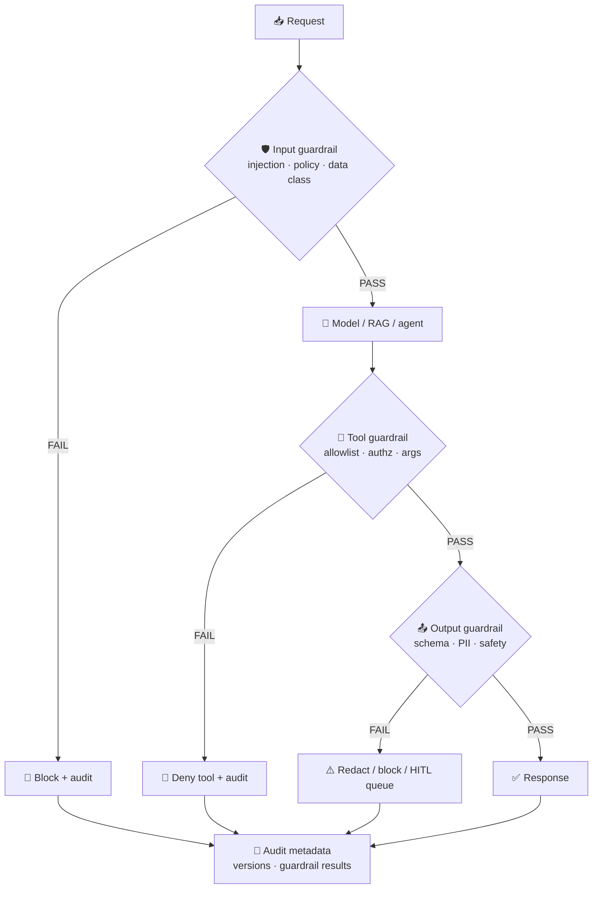

#### Template: Guardrail Specification

```markdown
Guardrail ID:
Name:
Type: Input / Output / Tool / Retrieval / Cost
Use Case:
Risk Level:

Triggers:
(when this guardrail runs)

Checks:
- Check 1:
- Check 2:

On failure:
- Action: Block / Redact / Escalate HITL / Log only
- User message:
- Retry policy:

Configuration:
- Enabled: true / false (prod must justify false)
- Thresholds / patterns / allowlists:
- Environment overrides:

Logging:
- Fields logged (no sensitive content):
- Metrics emitted:

Tests:
- Unit tests:
- Adversarial eval cases:

Owner:
Linked rules: [Rule IDs]
Linked eval cases: [case IDs]
```

#### Example: production guardrails (Spring / LangChain4j style)

Runtime config pattern (feature-flagged, tunable per environment):

```yaml
guardrail:
  prompt-injection:
    enabled: true
    threshold: 0.70
  output:
    enabled: true
    blocked-patterns: "(?i)\\b\\d{3}-\\d{2}-\\d{4}\\b"  # example: SSN-like patterns
  tool:
    allowlist: create_ticket,search_docs
    require-approval: send_email,delete_record
  cost:
    max-steps-per-run: 20
    max-tokens-per-request: 8192
```

Code wiring pattern: apply input/output guardrails on **every** AI service and agent builder — not only on chat endpoints.

Required guardrails by risk tier:

| Guardrail | Low | Medium | High | Critical |
| --- | --- | --- | --- | --- |
| Prompt injection (input) | Recommended | Required | Required | Required |
| Output PII/safety patterns | Optional | Required | Required | Required |
| Tool allowlist | If tools used | Required | Required | Required |
| Retrieval ACL filter | If RAG | Required | Required | Required |
| HITL escalation | — | On low confidence | Required | Required |
| Cost/step limits | Recommended | Required | Required | Required |

### 21.5 Validation chain — rules + skills + guardrails together

Use this chain at **release** and after **incidents**:

```
╔══════════════════════════════════════════════════════════════════╗
║  VALIDATION CHAIN — release & post-incident                      ║
╠══════════════════════════════════════════════════════════════════╣
║  ① Rules defined?      Permit/deny for data, tools, automation   ║
║  ② Skills bound?       Required workflows completed this phase   ║
║  ③ Evals passing?      Golden set + safety + regression (§9)    ║
║  ④ Guardrails enabled? Input/output/tool checks in prod config   ║
║  ⑤ Observability?      Block · escalation · override rates       ║
║  ⑥ Exception expired?  Temporary bypass reviewed or removed      ║
╚══════════════════════════════════════════════════════════════════╝
```

#### Release gate additions (guardrail-specific)

- Zero unresolved **deny-rule** violations in security review  
- Required **skills** outputs attached to release ticket  
- **Guardrails** enabled in prod config; disabled guardrails need governance exception  
- Adversarial cases from eval set tested against guardrails (injection, PII leak, unauthorized tool)  
- Rollback includes **guardrail config** and **rule/skill** version — not just application binary  

### 21.6 Coding agents vs production AI features

The same framework applies to **internal coding agents** (Cursor, Copilot, CLI agents) and **customer-facing AI features**, with different emphasis:

```
┌─────────────────────────────┬─────────────────────────────────────┐
│  💻 CODING AGENTS           │  🌐 PRODUCTION AI FEATURES            │
├─────────────────────────────┼─────────────────────────────────────┤
│  Rules                      │  Rules                              │
│  .cursor/rules · AGENTS.md  │  Enterprise AI policy + service cfg │
├─────────────────────────────┼─────────────────────────────────────┤
│  Skills                     │  Skills                             │
│  ai-assisted-engineering    │  java-ai-backend-engineering        │
│  stack packs                │  eval skills                        │
├─────────────────────────────┼─────────────────────────────────────┤
│  Guardrails                 │  Guardrails                         │
│  IDE policy · secret scan   │  input/output/tool · rate limits    │
│  CI checks                  │                                     │
├─────────────────────────────┼─────────────────────────────────────┤
│  Validation                 │  Validation                         │
│  ./gradlew check · PR review│  golden datasets · monitoring · HITL│
└─────────────────────────────┴─────────────────────────────────────┘
```

**Rule of thumb:** If a coding agent can touch it (auth, PII, payments), a **deny or require-review rule** must exist before the agent does.

### 21.7 Continuous improvement loop

When an AI incident or near-miss occurs, update controls in order:

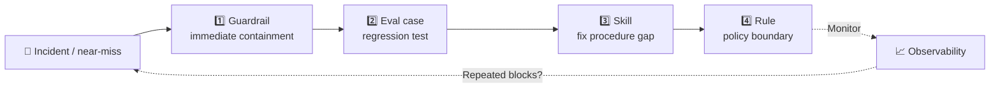

1. **Guardrail** — immediate containment (block pattern, tighten threshold)  
2. **Eval case** — regression test so it never ships again  
3. **Skill** — fix procedure gap if humans/agents skipped a step  
4. **Rule** — policy change if the boundary was unclear  

Do not rely on guardrails alone — repeated blocks signal a missing **rule** or **skill**.

### 21.8 Starter pack — minimum rules and skills

Implement these first (aligns with [Nine artifacts](#nine-artifacts-to-implement-first)):

**Rules (deny/require):**

1. No secrets or production PII in external LLM prompts  
2. No destructive agent tools without human confirmation  
3. No production AI release without eval gate  
4. No merge of AI-generated code without review + verification command  

**Skills (require for medium+ risk):**

1. `software-design-analysis` — intake  
2. `llm-application-architecture` or `agent-orchestration-design` — design  
3. `ai-evaluation-architecture` — pre-release  
4. `ai-assisted-engineering` — coding agent work  

**Guardrails (runtime):**

1. Prompt injection input guardrail  
2. Output schema or pattern validator  
3. Tool allowlist + permission check  
4. Step/token cost limit for agents  

---

## Recommended Operating Model

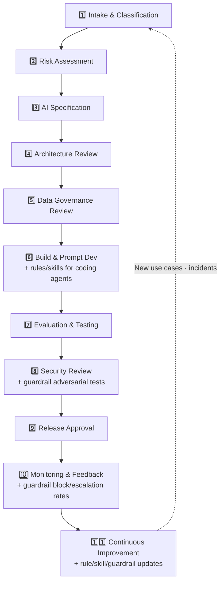

## Maturity Roadmap

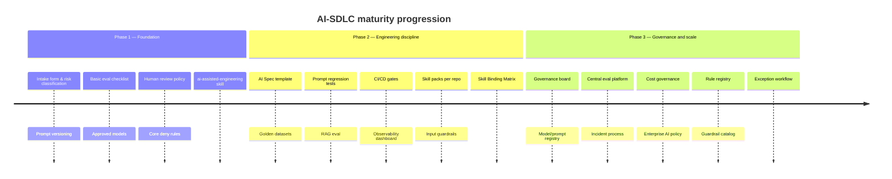

| Phase | Focus |
| --- | --- |
| **1 — Foundation** | Intake form, risk classification, prompt versioning, basic eval checklist, approved models, human review policy, **core deny rules**, **ai-assisted-engineering skill** |
| **2 — Engineering discipline** | AI Spec template, golden datasets, prompt regression tests, RAG eval, CI/CD gates, observability dashboard, **skill packs per repo**, **input guardrails**, **Skill Binding Matrix** |
| **3 — Governance and scale** | Governance board, model/prompt registry, central eval platform, incident process, cost governance, enterprise AI policy, **rule registry**, **guardrail catalog**, **exception workflow** |

## Nine artifacts to implement first

```
┌─────────────────────┬─────────────────────┬─────────────────────┐
│  ① USE CASE CARD    │  ② RISK MATRIX      │  ③ AI SPEC TEMPLATE │
│  Intake form        │  Classification     │  System contract    │
├─────────────────────┼─────────────────────┼─────────────────────┤
│  ④ EVAL CHECKLIST   │  ⑤ PROD READINESS   │  ⑥ MONITORING STD   │
│  Golden set + gates │  Launch sign-off    │  Dashboard standard │
├─────────────────────┼─────────────────────┼─────────────────────┤
│  ⑦ POLICY RULE SET  │  ⑧ SKILL BINDING    │  ⑨ GUARDRAIL SPEC   │
│  Deny/require rules │  Per use case/repo  │  Input·output·tool  │
└─────────────────────┴─────────────────────┴─────────────────────┘
```

**Foundation (1–6):** AI Use Case Intake Form · AI Risk Classification Matrix · AI System Specification Template · AI Evaluation Checklist · AI Production Readiness Checklist · AI Monitoring Dashboard Standard  

**Controls layer (7–9):** Policy Rule Set (minimum deny/require rules) · Skill Binding Matrix (per use case or repo) · Guardrail Specification (input + output + tool for medium+ risk)  

---

## Framework naming options

| Name | Emphasis |
| --- | --- |
| AI Delivery Governance Framework | Executive / compliance audience |
| AI-SDLC Operating Framework | Engineering orgs |
| Responsible AI Engineering Lifecycle | Policy + engineering balance |
