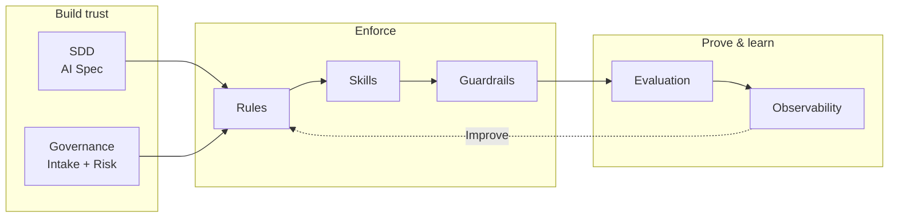
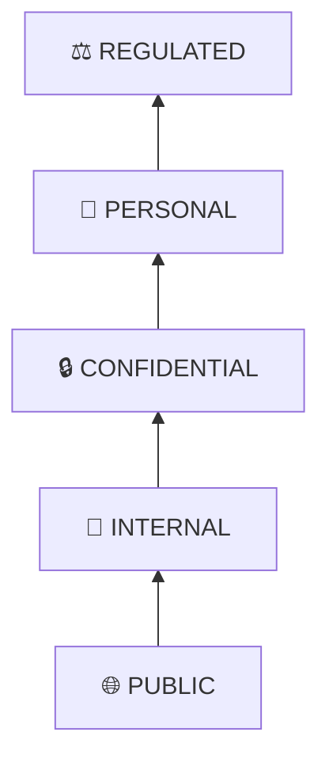
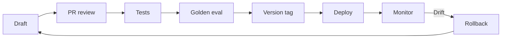
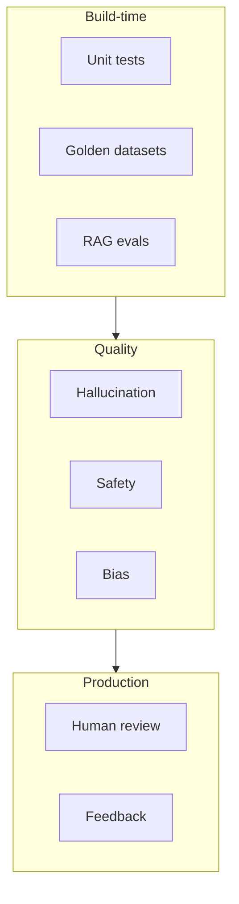
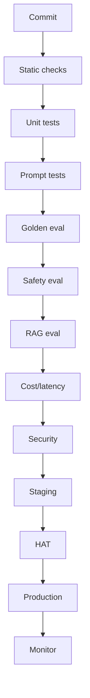
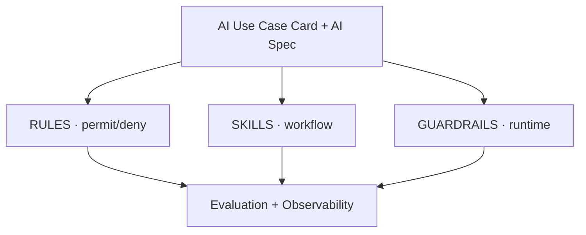
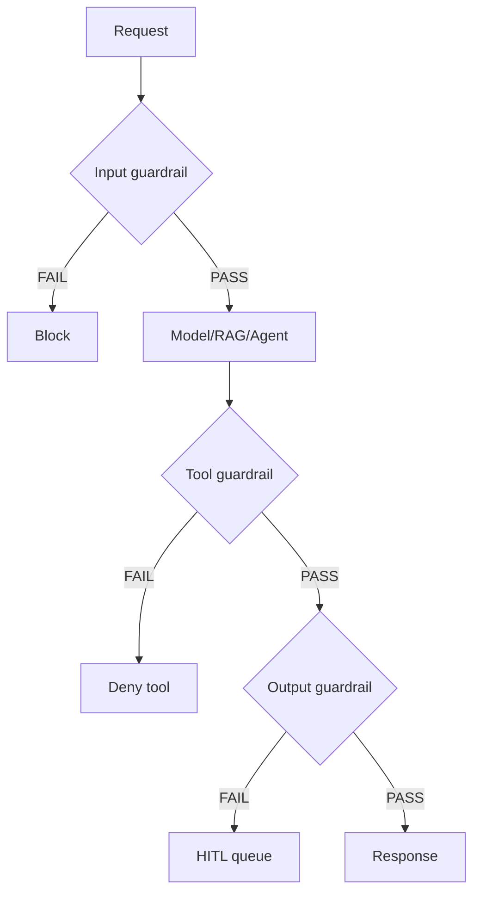
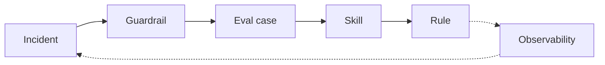
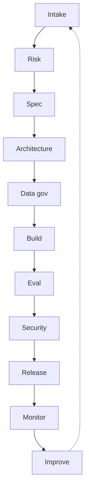
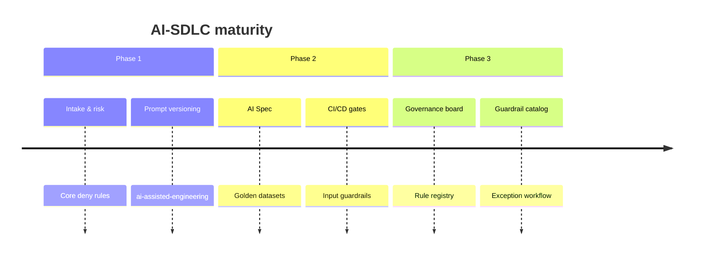

# AI-SDLC Visual Supplement — Workshop Slides

Companion to [`ai-sdlc-framework-reference.md`](./ai-sdlc-framework-reference.md).  
Copy individual diagrams into slide decks, Miro boards, or workshop handouts.

---

## Slide 1 — Framework at a glance



**Talking point:** AI-SDLC = SDD + Governance + Rules/Skills/Guardrails + Evaluation + Observability.

---

## Slide 2 — Data classification pyramid



**Talking point:** Higher tiers require more review before data reaches an LLM.

---

## Slide 3 — Prompt lifecycle



**Talking point:** Prompts are code — version, test, monitor, rollback.

---

## Slide 4 — Evaluation layers



---

## Slide 5 — CI/CD pipeline



**Talking point:** Version code, prompts, models, tools, evals, rules, and guardrails together.

---

## Slide 6 — Three-layer control model



---

## Slide 7 — Guardrail decision flow



---

## Slide 8 — Incident improvement loop



**Talking point:** Contain first, then prevent recurrence through eval → skill → rule.

---

## Slide 9 — Operating model cycle



---

## Slide 10 — Maturity timeline



---

## Slide 11 — Nine artifacts grid

```
┌─────────────────────┬─────────────────────┬─────────────────────┐
│  ① USE CASE CARD    │  ② RISK MATRIX      │  ③ AI SPEC          │
├─────────────────────┼─────────────────────┼─────────────────────┤
│  ④ EVAL CHECKLIST   │  ⑤ PROD READINESS   │  ⑥ MONITORING       │
├─────────────────────┼─────────────────────┼─────────────────────┤
│  ⑦ POLICY RULES     │  ⑧ SKILL BINDING    │  ⑨ GUARDRAIL SPEC   │
└─────────────────────┴─────────────────────┴─────────────────────┘
```

---

## Workshop exercise prompts

| Exercise | Artifact | Time |
| --- | --- | --- |
| Classify a use case | AI Use Case Card | 15 min |
| Map data tier | Data pyramid | 10 min |
| Draft one deny rule | Policy Rule Card | 10 min |
| Bind skills to phases | Skill Binding Matrix | 15 min |
| Define release gate | Eval scorecard + gate card | 20 min |
| Walk guardrail flow | Guardrail decision diagram | 15 min |

---

## Export tips

- **Mermaid Live Editor:** paste diagrams for PNG/SVG export  
- **GitHub / GitLab:** renders mermaid in markdown natively  
- **Notion / Confluence:** use mermaid plugins or export as images  
- **Print handouts:** ASCII card boxes render well in monospace PDFs
