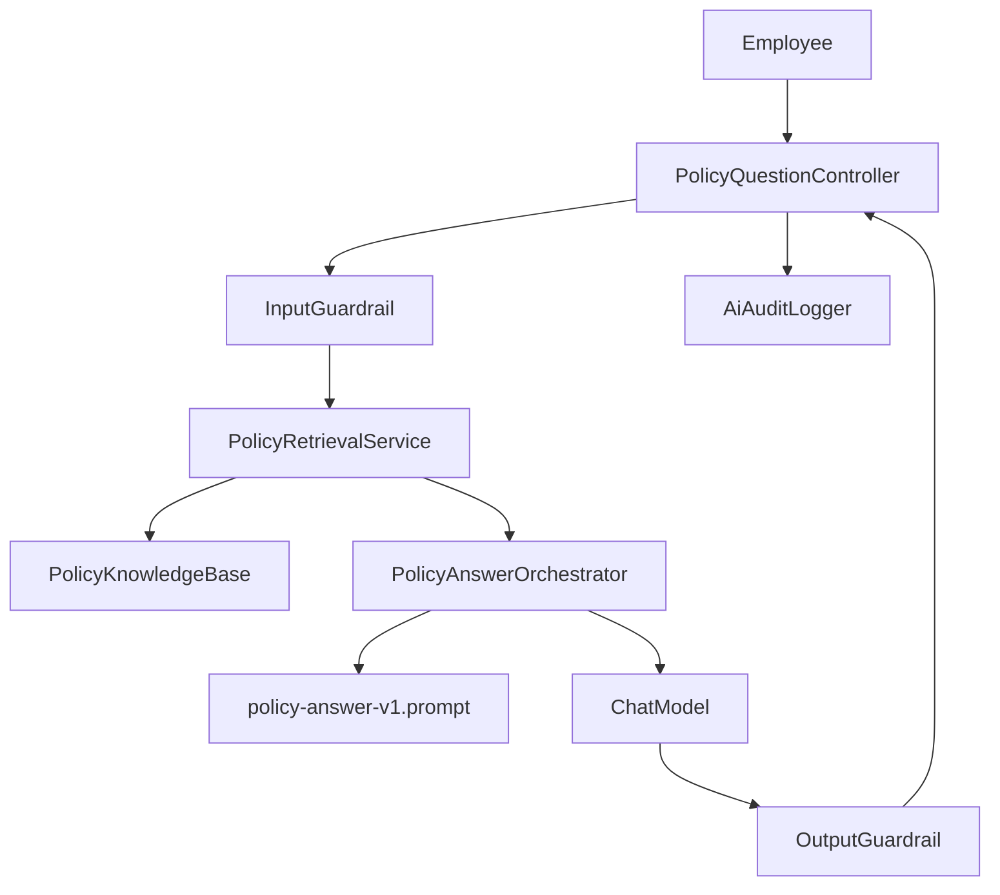

# AI Architecture Pattern Selection

| Field | Value |
| --- | --- |
| **Use Case** | HR Policy Assistant |
| **System Name** | Policy Assistant |
| **Author** | Platform Engineering |
| **Date** | 2026-07-02 |
| **Linked AI Spec** | [ai-spec.md](../03-specification/ai-spec.md) |

## Pattern Selection

- [ ] Prompt-only LLM
- [ ] LLM with structured output
- [x] RAG
- [ ] Agent with tools
- [ ] Multi-agent workflow
- [ ] ML model inference
- [ ] Hybrid AI workflow
- [ ] Other: N/A

**Rationale:**

The assistant must answer from HR policy documents and cite sources. RAG provides a simpler and more controllable pattern than an agent because the feature does not need tools, planning, or autonomous actions.

## Architecture Diagram

## Components

| Component | Responsibility | Owner / team |
| --- | --- | --- |
| UI | Not included; API-ready sample | Product / frontend team |
| Backend API | Validate request DTO and expose policy Q&A endpoint | Platform Engineering |
| AI Orchestrator | Build prompt, call chat model, parse structured output | Platform Engineering |
| Prompt Manager | Load versioned prompt template | Platform Engineering |
| Model Provider | Stub local chat model for deterministic sample behavior | AI Platform |
| Retriever | Keyword search over approved policy markdown files | Platform Engineering |
| Tool Executor | N/A | N/A |
| Validation Layer | Input and output guardrails | Platform Engineering |
| Audit Logger | Log AI metadata without full prompt/response content | Platform Engineering |
| Monitoring | Actuator metrics plus AI audit log pipeline | SRE |

## Required Controls for Selected Pattern

| Control | Required? | Notes |
| --- | --- | --- |
| Output schema validation | Yes | `PolicyAnswerOrchestrator` parses JSON and falls back safely |
| Citations | Yes | Required for answered responses |
| ACL filtering on retrieval | Required before multi-user production | Not implemented in local static sample |
| Tool allowlist | N/A | No tools |
| Human approval for risky actions | N/A | No actions |
| Rate limits | Required in production gateway | Outside local sample |
| Cost / step limits | Required for external model profile | Stub profile has no model cost |

## Review

| Role | Name | Date | Approved? |
| --- | --- | --- | --- |
| AI Architect | AI Architect sample reviewer | 2026-07-02 | Yes |
| Engineering Lead | Platform Engineering sample owner | 2026-07-02 | Yes |
| Security | Security sample reviewer | 2026-07-02 | Yes |
